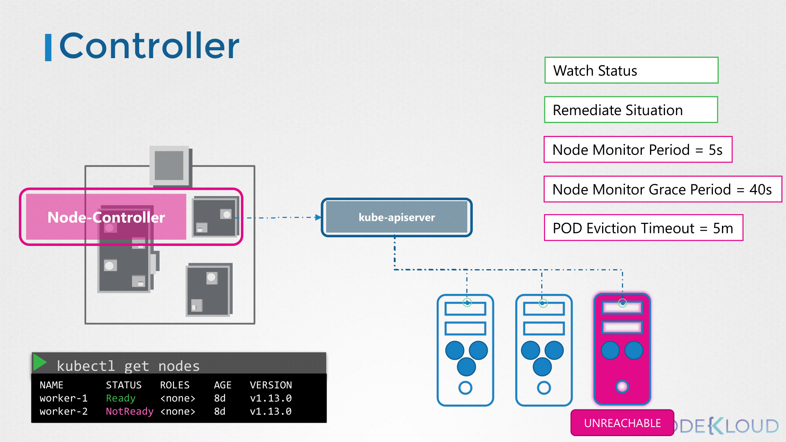
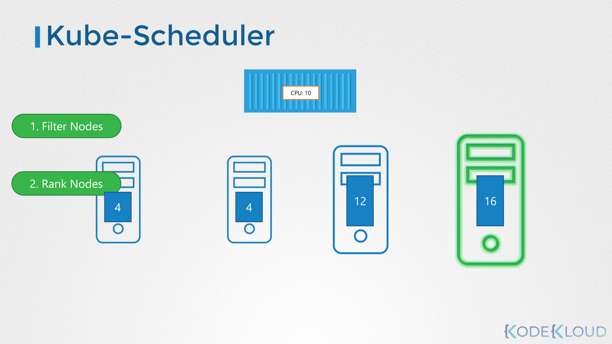
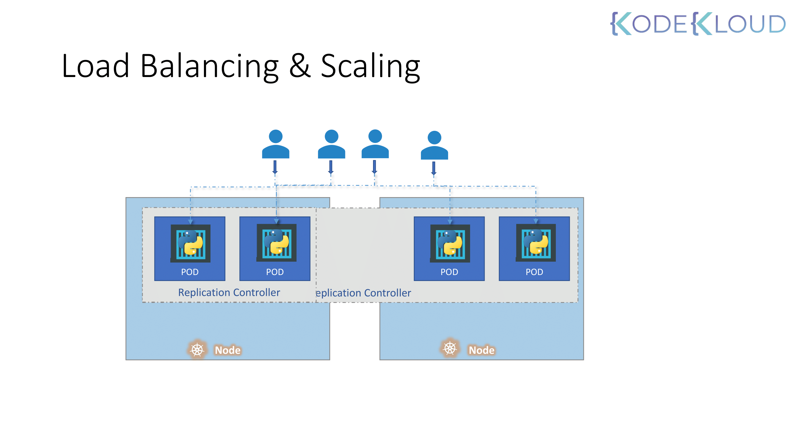

# Core Concepts

## Cluster Architecture

### 쿠버네티스의 목적

- 애플리케이션을 컨테이너 형식으로, 자동화된 방식으로 호스팅하는 것.
  - 요구에 따라 애플리케이션의 많은 인스턴스를 쉽게 배포할 수 있다.
  - 애플리케이션 내 다양한 서비스 간의 통신이 쉽게 가능하다.

### Kubernetes Cluster Architecture

- 쿠버네티스가 하는 역할은 크게 두 가지로 나뉜다. 배로 비유하자면:
  - Cargo Ships that Carries Containers.
  - Monitoring / Managing the Cargo Ships.


**노드**
> 쿠버네티스 클러스터는 위의 역할을 담당하기 위한 **노드**의 집합이다.

- **워커 노드**: 컨테이너를 Loading하기 위한 용도의 Cargo Ship.

- **마스터 노드**: 컨테이너를 올릴 Cargo Ship(Worker Node)을 관리하는 Control Ship.
  - 어떤 종류의 컨테이너를 올릴 것인지 정의한다.
  - 관리하고 있는 Ship의 정보를 저장한다.
  - 컨테이너의 상태를 모니터링하고 추적한다 (Manage the Whole Loading Process 등).

**컨트롤 플레인 컴포넌트**
> 마스터 노드는 위에 정의한 작업들을 수행하기 위해 **컨트롤 플레인 컴포넌트**라는 것을 사용한다.

- **etcd**: 언제, 어떤 컨테이너가 어떤 노드에 올라갔는 지를 저장하기 위한 키-값 저장소.
- **kube-scheduler**: 노드가 배정되지 않은 새로 생성된 파드를 감지하고, 실행할 노드를 선택한다.
  - resource requirement
  - 워커 노드의 capacity
  - 기타 policy / constraint 고려 (e.g. node-affinity rule)
- **kube-controller-manager**
  - **노드 컨트롤러**: 클러스터에 있는 노드를 관리한다.
    - 새 노드가 추가되거나, 사용 불가능하거나 파괴되는 상황을 처리한다.
  - **레플리케이션 컨트롤러**: 파드가 특정 개수만큼 복제되고 동작하는 것을 보장한다.
- **kube-apiserver**: 클러스터 내에서 모든 작업을 오케스트레이션한다.
  - 쿠버네티스 API를 노출하는 컨트롤 플레인 컴포넌트이다.

**노드 컴포넌트**
> **노드 컴포넌트**는 동작 중인 파드를 유지시키고 쿠버네티스 런타임 환경을 제공하며, 모든 노드 상에서 동작한다.

- **컨테이너 런타임**: 컨테이너 실행을 담당하는 소프트웨어이다 (e.g. Docker, containerd)
- **kubelet**: 클러스터의 각 노드에서 실행되는 에이전트이다.
  - kube-apiserver에서 오는 요청을 받아서 노드에 적용한다.
  - 주기적으로 kube-apiserver에서 노드와 컨테이너 상태를 모니터링하기 위해 상태 보고서를 가져온다.
- **kube-proxy**: 실행 중인 컨테이너 애플리케이션 간 통신을 담당한다.
  - 각 워커 노드에서 개별적으로 실행되는 서비스이다.

## ETCD in Kubernetes

### What is ETCD?

> A distributed, reliable key-value store that is simple, secure and fast.


- etcd 클러스터에 노드, 파드, 컨피그, 시크릿, 어카운트 등의 쿠버네티스 오브젝트 정보를 저장한다.
  - 값이 정상적으로 저장되거나 변경되면 task가 완전히 complete된 것으로 간주한다.
- `kubectl get` 명령어를 사용했을 때 etcd에 저장된 값을 리턴한다.

### key-value store

- 일반적인 테이블 형태로 저장하는 대신, configuration처럼 적은 용량을 빠르게 읽고 쓰기 위해 사용한다.

### ETCD 실행하기

```bash
./etcd
```

- 로컬에서 실행할 경우, 2379번 포트를 사용한다.

### 직접 설치할 경우

```bash
wget -q --https-only \
"https://github.com/etcd-io/etcd/releases/download/v3.5.11/etcd-v3.5.11-linux-amd64.tar.gz"
```

- `--advertise-client-urls` 옵션은 kube-apiserver에서 etcd 클러스터에 접근하기 위해 설정해주어야 하는 필드이다.

### kubeadm으로 설치할 경우

```bash
kubectl get pods -n kube-system
```

- kube-system이라는 네임스페이스에 파드 형태로 etcd server가 생성된다.
- 파드 내부의 컨테이너에서 `etcdctl` 명령어로 리소스 접근이 가능하다.

### Explore ETCD

- 파드 내부 디렉토리를 확인해보면 레지스트리 하위 경로에 여러 쿠버네티스 구성 요소가 존재한다.
  - minions
  - pods
  - replicasets
  - deployments
  - roles
  - secrets

### ETCD in HA Environment

- `etcd.service` 필드의 `--initial-cluster` 항목에 etcd server의 경로를 입력한다.

## Kube API Server

- `kubectl` 명령어를 실행하면 기본적으로 kube-apiserver로 요청이 전달된다.
- 또는 `kubectl` 대신 API를 직접 호출할 수 도 있다.


1. Authenticate User
2. Validate Request
3. Retrieve data
4. Update ETCD
5. Scheduler
6. Kubelet

- 다른 형태의 요청도 대부분 위와 같은 절차를 거쳐 이루어진다.
- 즉, 쿠버네티스에서 리소스와 오브젝트를 관리하는 주체는 kube-apiserver이다.
- etcd에 유일하게 직접 접근할 수 있다.
  - 쿠버네티스의 다른 오브젝트/리소스는 kube-apiserver를 통해 etcd에 접근해야 한다.

### Kube API Server 설치하기

```bash
wget https://storage.googleapis.com/kubernetes-release/release/v1.27.0/bin/linux/amd64/kube-apiserver
```

- kubeadm을 사용할 경우 kube-apiserver를 직접 설치할 필요는 없지만, 바이너리 형태로 직접 설치할 수도 있다.
- kubeadm으로 설치했다면, 마스터 노드의 kube-system 네임스페이스에 kube-apiserver-master라는 이름의 파드가 생성된다.

### Kube API Server Options

- kubeadm으로 설치했다면, 파드를 정의한 yaml 파일은 아래 경로를 통해 확인할 수 있다.
  ```bash
  cat /etc/kubernetes/manifests/kube-apiserver.yaml
  ```
- kubeadm 없이 직접 설치했다면, kube-apiserver의 옵션은 아래 경로를 통해 확인할 수 있다.
  ```bash
  cat /etc/systemd/system/kube-apiserver.service
  ```
- 마스터 노드에서 실행 중인 프로세스 중 kube-apiserver에서 실행되는 것들은 아래 명령어로 확인할 수 있다.
  ```bash
  ps -aux | grep kube-apiserver
  ```

## Kube Controller Manager

- 쿠버네티스의 다양한 컨트롤러를 관리한다.
- 컨트롤러는 지속적으로 시스템 내 다양한 구성 요소의 상태를 모니터링하고, 시스템 전체를 원하는 기능 상태로 만든다.

### 노드 컨트롤러



- 노드 컨트롤러는 kube-apiserver를 통해 노드의 상태를 모니터링하고 애플리케이션이 계속 실행되도록 필요한 행동을 한다.

### 레플리케이션 컨트롤러


- 레플리케이션 컨트롤러는 레플리카의 상태를 모니터링하고 원하는 수의 파드가 항상 사용 가능하도록 한다.
- 파드가 죽으면 재생성한다.

### 쿠버네티스의 다양한 컨트롤러


- 쿠버네티스에서는 오브젝트를 관리하기 위해 여러 종류의 컨트롤러를 사용한다.
- 다양한 컨트롤러들은 kube-controller-manager라는 단일 프로세스로 관리된다.
- 즉, kube-controller-manager를 설치하면 다른 컨트롤러도 설치된다.

### Kube Controller Manager 설치하기

```bash
wget https://storage.googleapis.com/kubernetes-release/release/v1.27.0/bin/linux/amd64/kube-controller-manager
```

- `--controllers` 옵션으로 컨트롤러를 활성화할지 지정할 수 있다.
  - 기본값으로 설정하면 모든 종류의 컨트롤러가 전부 활성화된다.
  - 컨트롤러가 작동하지 않거나 존재하지 않을 경우, 해당 옵션을 살펴보면 된다.

### Kube Controller Manager Options

- kubeadm으로 설치했다면, 파드를 정의한 yaml 파일은 아래 경로를 통해 확인할 수 있다.
  ```bash
  cat /etc/kubernetes/manifests/kube-controller-manager.yaml
  ```
- kubeadm 없이 직접 설치했다면, kube-controller-manager의 옵션은 아래 경로를 통해 확인할 수 있다.
  ```bash
  cat /etc/systemd/system/kube-controller-manager.service
  ```
- 현재 실행 중인 kube-controller-manager 프로세스는 아래 명령어로 확인할 수 있다.
  ```bash
  ps -aux | grep kube-controller-manager
  ```

## Kube Scheduler

- 어떤 파드가 어떤 노드에 위치할 것인가를 결정한다.
- 실제로 파드를 배치하지는 않는다.
- Filter Nodes/Rank Nodes 작업을 통해 파드를 설치할 수 있는 최적의 노드를 선정한다.



- 예시 그림의 CPU 요구량은 10이므로 CPU 4인 노드는 대상에서 제외된다.
- CPU를 할당한 후 남은 리소스가 많을 수록 가중치가 높다.
- 예시의 경우 CPU 16개가 있는 노드의 가중치가 더 높기 때문에 선택된다.
- High Level에서는 위와 같은 방식으로 작동하며, 사용자의 구성에 따라 값이 변할 수 있다.

### Kube Scheduler 설치하기

```bash
wget https://storage.googleapis.com/kubernetes-release/release/v1.27.0/bin/linux/amd64/kube-scheduler
```

### Kube Scheduler Options

- kubeadm으로 설치했다면, 파드를 정의한 yaml 파일은 아래 경로를 통해 확인할 수 있다.
  ```bash
  cat /etc/kubernetes/manifests/kube-scheduler.yaml
  ```
- 현재 실행 중인 kube-scheduler 프로세스는 아래 명령어로 확인할 수 있다.
  ```bash
  ps -aux | grep kube-scheduler
  ```

## Kubelet

- 마스터 노드의 kube-scheduler의 지시에 따라, 컨테이너를 load/unload한다.


- 자신이 실행되고 있는 노드를 클러스터에 등록한다.
- kube-apiserver로부터 노드에 컨테이너나 파드를 load하라는 지시를 받으면, 컨테이너 런타임 엔진에 이미지 실행을 요청한다.
- 파드와 컨테이너의 상태를 지속적으로 모니터링하고, 이를 kube-apiserver에 주기적으로 전달한다.

### Kubelet 설치하기

```bash
wget https://storage.googleapis.com/kubernetes-release/release/v1.27.0/bin/linux/amd64/kubelet
```

- kubeadm으로 설치할 수 없고, 워커 노드에 항상 수동으로 설치해야 한다.

### Kubelet Options

- 현재 실행 중인 kubelet 프로세스는 아래 명령어로 확인할 수 있다.
  ```bash
  ps -aux | grep kubelet
  ```

## Kube Proxy

- 기본적으로 같은 클러스터에 배포된 파드끼리는 통신이 자유롭다.
- 파드 네트워크는 모든 파드가 통신할 수 있도록 클러스터의 모든 노드에 생성되는 가상 네트워크이다.


- 특정 파드에서 다른 파드에 접근하기 위한 최적의 방법은 서비스를 이용하는 것이다.
- 예를 들어 데이터베이스가 실행 중인 파드의 IP 주소가 생성되지만, 이 주소는 가변적이다.
  - 파드의 재배포 등의 이슈로 IP 주소가 변경될 수 있다.
- 웹 애플리케이션은 이름이 DB인 서비스를 찾아 데이터베이스에 액세스할 수 있다.
- 서비스는 별도의 IP 주소를 가지고 있으며, 서비스는 백엔드 파드로 트래픽을 포워딩하는 역할을 한다.
- 서비스는 실제 오브젝트가 아니고, 쿠버네티스 메모리에 존재하는 가상 구성 요소이다.
  - 파드나 컨테이너 개념이 아니므로, 파드 네트워크에 접근하는 방식으로 포워딩하지 않는다.
- 서비스가 여러 노드의 각 파드에 접근할 수 있는 이유는 kube-proxy의 존재 때문이다.
- kube-proxy는 쿠버네티스 클러스터의 각 노드에서 실행되는 프로세스이다.
- 서비스를 탐지하고, 새로운 서비스가 등장할 경우 규칙(e.g. iptable)을 설정하여 트래픽 포워딩을 가능하게 한다.

### Kube Proxy 설치하기

```bash
wget https://storage.googleapis.com/kubernetes-release/release/v1.27.0/bin/linux/amd64/kube-proxy
```

### Kubeadm을 사용할 경우

- kubeadm은 각 노드에 kube-proxy 파드를 배포하며, 데몬셋으로 배포된다.
  ```bash
  kubectl get demonset -n kube-system
  ```

## Pods

- 쿠버네티스는 컨테이너를 직접적으로 워커 노드에 배포하지 않는다.
- 컨테이너는 파드라는 오브젝트로 캡슐화되며, 파드는 쿠버네티스에서 가장 작은 오브젝트이다.


- 트래픽이 증가해 Scale-out을 할 경우, 같은 파드 내 새로운 컨테이너가 생성되는 것이 아니라 새로운 파드가 생성된다.
- 현재 노드가 충분한 용량을 확보하지 못할 경우, 새로운 노드에 파드가 추가된다.

### Multi-Container Pods


- 일반적으로 파드와 컨테이너는 1:1 관계를 유지하며, 스케일링을 위해 컨테이너가 아닌 파드의 개수를 조절한다.
- 파드 하나에 여러 개의 컨테이너를 생성하는 경우는 보통 애플리케이션의 모니터링이나 health check 기능을 적용하기 위해서다.
- 동일한 네트워크를 공유하므로 두 컨테이너는 로컬호스트로 통신이 가능하며, 같은 저장 공간을 사용할 수 있다.

## Pods with YAML

- 쿠버네티스에서는 파드, 레플리카셋, 디플로이먼트, 서비스 등의 생성을 위한 입력으로 yaml 파일을 사용한다.
- 쿠버네티스의 모든 오브젝트는 기본적으로 4개의 필드를 포함한다.
  ```yaml
  apiVersion: v1
  kind: Pod
  metadata:
    name: myapp-pod
    labels:
      app: myapp
      type: front-end
  spec:
    containers:
      - name: nginx-container
        image: nginx
  ```
  - **apiVersion**: 오브젝트를 생성할 때 사용하는 쿠버네티스 API 버전이다. 생성하려는 것에 따라 올바른 API 버전을 사용해야 한다.
  - **kind**: 어떤 종류의 오브젝트를 생성할 것인지 명시한다.
  - **metadata**: 오브젝트를 설명하는 기본적인 데이터로, name이나 labels 등 키-값 형식으로 데이터를 정의한다.
    - name과 labels는 동일한 line에 있어야 한다. 서로는 siblings 관계이고, metadata의 children 관계이다.
    - 쿠버네티스에서 metadata 필드는 쿠버네티스 API에 정의된 필드만 사용할 수 있다.
    - 대신, labels 필드에서는 어떤 값이든 키-값 형태로 정의하여 사용할 수 있다.
  - **spec**: 생성하려는 오브젝트와 관련된 추가 정보를 명시한다.
- `kubectl create -f pod-definition.yaml` 명령어로 파드를 생성할 수 있다.

## ReplicaSets

### High Availability


- 애플리케이션이 만약 어떤 이유로 인해서 충돌이 발생하거나 파드가 fail이 발생했다면 사용자는 애플리케이션에 접근할 수 없게 된다.
- 이러한 일을 예방하기 위해서 동시에 여러 개의 파드를 띄운다.
  - 파드 하나에서 문제가 발생하더라도 다른 파드로 여전히 사용자는 접근할 수 있기 때문이다.
- 파드가 하나 뿐이어도 레플리케이션 컨트롤러는 기존의 파드가 fail이 발생해도 자동으로 새로운 파드를 띄운다.
- 레플리케이션 컨트롤러는 특정 파드가 항상 실행되도록 보장한다.

### Load Balancing & Scaling



- 여러 개의 파드 간 로드밸런싱을 수행한다.
- 파드에 들어오는 요청이 많을 경우, 추가로 파드를 생성할 수 있게 지원한다.
- 만약 노드 리소스가 부족할 경우, 다른 노드에서 파드를 생성하고 로드밸런싱을 수행한다.

### 레플리케이션 컨트롤러와 레플리카셋

- 동일한 목적으로 만들어진 오브젝트이며, 레플리케이션 컨트롤러는 레플리카셋으로 대체되고 있다.

**레플리케이션 컨트롤러**

```yaml
apiVersion: v1
kind: ReplicationController
metadata:
  name: myapp-rc
  labels:
    app: myapp
    type: front-end
spec:
  template:
    metadata:
      name: myapp-pod
      labels:
        app: myapp
        type: front-end
    spec:
      containers:
        - name: nginx-controller
          image: nginx
  replicas: 3
```

- spec.template 하위 항목에 파드에서 사용하던 metadata, spec을 그대로 적용한다.
- 몇 개의 파드를 유지할 것인지를 spec.replicas 필드에 명시한다.
- 아래 명령어를 통해 레플리케이션 컨트롤러를 확인할 수 있다.
  ```bash
  kubectl get replicationcontroller
  ```

**레플리카셋**

```yaml
apiVersion: apps/v1
kind: ReplicaSet
metadata:
  name: myapp-replicaset
  labels:
    app: myapp
    type: front-end
spec:
  template:
    metadata:
      name: myapp-pod
      labels:
        app: myapp
        type: front-end
    spec:
      containers:
        - name: nginx-controller
          image: nginx
  replicas: 3
  selector:
    matchLabels:
      type: front-end
```

- apiVersion이 apps/v1으로 레플리케이션 컨트롤러와 다르다.
- selector 필드가 required로 변경되었다.
  - selector 필드는 레플리카셋을 생성하기 전에 만들었던 파드 중 셀렉터에 포함되는 파드까지 통제할 수 있다.
  - matchLabels.type 형태로 레이블에 정의한 값을 선택하여 통제가 가능하다.
- 아래 명령어를 통해 레플리카셋을 확인할 수 있다.
  ```bash
  kubectl get replicaset
  ```

### 레이블과 셀렉터


- 클러스터 내 수많은 파드 중에서 레플리카셋이 모니터링하고 관리해야 할 파드를 식별하기 위해 사용한다.
- 다른 컨트롤러에서도 비슷한 목적으로 레이블과 셀렉터를 사용한다.

### Scale

- 스케일링을 하는 방법은 여러 가지가 있다.
  - yaml 파일의 replicas를 변경하고, 아래 명령을 실행한다.
    ```bash
    kubectl replace -f replicaset-definition.yaml
    ```
  - `kubectl scale` 명령어를 사용한다. 이 방식을 사용할 경우 yaml 파일의 replicas는 자동으로 업데이트되지 않는다는 점을 주의해야 한다.
    ```bash
    kubectl scale --replicas=6 -f replicaset-definition.yaml
    # kubectl scale --replicas=6 -f replicaset myapp-replicaset
    ```

## Deployment


- 디플로이먼트는 레플리카셋보다 상위 개념의 오브젝트이다.
  - 롤링 업데이트 기능
  - 롤백 기능
  - 스케일링/모니터링과 같은 기능을 모든 파드에 일괄 적용하기 위한 pause/resume 기능

**디플로이먼트**

```yaml
apiVersion: apps/v1
kind: Deployment
metadata:
  name: myapp-deployment
  labels:
    app: myapp
    type: front-end
spec:
  template:
    metadata:
      name: myapp-pod
      labels:
        app: myapp
        type: front-end
    spec:
      containers:
        - name: nginx-container
          image: nginx
  replicas: 3
  selector:
    matchLabels:
      type: front-end
```

- 아래 명령어를 통해 디플로이먼트를 확인할 수 있다.
  ```bash
  kubectl get deployments
  ```

## Service

- 서비스는 애플리케이션 안팎의 다양한 구성 요소간의 통신을 가능하게 한다.
  - 애플리케이션을 다른 애플리케이션 또는 사용자와 연결하는 것을 돕는다.
  - MSA에서 느슨한 결합을 가능하게 한다.

### NodePort

- 서비스가 노드의 포트에서 내부 파드에 접근할 수 있도록 한다.


- targetPort: 실제 웹 서버가 동작하는 포트이다.
- port: 서비스 자신의 포트이다.
- nodePort: 외부에서 웹 서버에 액세스하는 데 사용하는 노드 자체의 포트이다. 30,000~32,767의 범위를 가진다.

```yaml
apiVersion: v1
kind: Service
metadata:
  name: myapp-service
spec:
  type: NodePort
  ports:
    - targetPort: 80
      port: 80
      nodePort: 30008
  selector:
    app: myapp
    type: front-end
```

- targetPort 필드는 입력하지 않을 경우 port 필드의 값과 동일하며, nodePort를 입력하지 않은 경우 범위 내에서 사용 가능한 포트가 랜덤 배정된다.
- 어떤 파드와 연결할 것인지는 파드 레이블에 정의한 값을 셀렉터로 불러온다.
- 셀렉터로 식별할 수 있는 파드가 여러 개라면, 여러 개의 파드에 대해 로드밸런싱을 수행한다.
  - 로드밸런싱 알고리즘은 무작위 알고리즘을 사용한다.

### ClusterIP

- 클러스터 안에서 가상 IP를 생성하여 서로 다른 서비스와 상호 통신을 할 수 있게 해준다.


- 프론트엔드, 백엔드, 데이터베이스와 같이 여러 레이어로 구성된 애플리케이션을 사용할 경우, 여러 파드 간 통신을 원활하게 하기 위한 엔드포인트 역할을 한다.
- 각 레이어는 다른 레이어에 미칠 영향을 고려할 필요 없이 Scale-out이 가능하다.

```yaml
apiVersion: v1
kind: Service
metadata:
  name: back-end
spec:
  type: ClusterIP
  ports:
    - targetPort: 80
      port: 80
  selector:
    app: myapp
    type: back-end
```

### LoadBalancer

- 클라우드 공급자(e.g. AWS, GCP, Azure)에서 제공하는 로드밸런서를 사용할 수 있도록 지원하고 있다.
- yaml 파일에서 type을 LoadBalancer로 지정하면, 클라우드 플랫폼에서 실행 시 네이티브 로드밸런서를 지원한다.

```yaml
apiVersion: v1
kind: Service
metadata:
  name: myapp-service
spec:
  type: LoadBalancer
  ports:
    - targetPort: 80
      port: 80
      nodePort: 30008
```

## Namespaces

- 네임스페이스로 각 환경을 구분지을 수 있다.
- 네임스페이스별로 자원을 각각 할당할 수 있다.
- 네임스페이스 내에서 리소스들은 이름으로 호출할 수 있다.


- default 네임스페이스는 클러스터가 처음 구성될 때 쿠버네티스에 의해 자동 생성된다.
- 내부 목적으로 사용하는 파드와 서비스 등은 사용자에 의해 실수로 삭제되는 것을 방지하기 위해 kube-system 네임스페이스에 생성된다.
- 모든 사용자들이 리소스를 사용 가능하게 하려면 kube-public 네임스페이스에 생성한다.


- 기업이나 프로덕션 환경에서는 네임스페이스 사용을 고려해야 한다.
- 예를 들어, 네임스페이스를 통해 dev와 prod 환경에서 리소스를 분리할 수 있다.
- 리소스 쿼터를 통해 네임스페이스별 리소스 사용을 제한할 수 있다.

### DNS


- 같은 네임스페이스의 리소스 간에는 이름만으로 호출이 가능하다.
  ```text
  mysql.connect("db-service")
  ```
- 다른 네임스페이스의 리소스를 호출하려면 서비스의 DNS 전체 이름을 입력해야 한다.
  ```text
  mysql.connect("db-service.dev.svc.cluster.local")
  ```

### Commands

- `kubectl get pods`는 default 네임스페이스에 있는 파드만 열거한다.
- `--namespace` 옵션을 통해 해당 네임스페이스의 파드를 열거할 수 있다.
  ```bash
  kubectl get pods --namespace=kube-system
  ```
- `--all-namespaces` 옵션을 통해 모든 네임스페이스의 파드를 열거할 수 있다.
  ```bash
  kubectl get pods --all-namespaces
  ```
- 다른 네임스페이스에 파드를 생성하려면, `--namespace` 옵션을 사용한다.
  ```bash
  kubectl create -f pod-definition.yaml --namespace=dev
  ```
- yaml 파일에서 metadata.namespace를 명시하면 해당 네임스페이스에 항상 생성된다.
  ```yaml
  metadata:
    name: myapp-pod
    namespace: dev
  ```
- 아래 명령어를 통해 현재 네임스페이스를 변경할 수 있다.
  ```bash
    kubectl config set-context $(kubectl config current-context) --namespace=dev
  ```

### 네임스페이스 생성하기

**네임스페이스**

```yaml
apiVersion: v1
kind: Namespace
metadata:
  name: dev
```

- 또는 아래 명령어를 통해 네임스페이스를 생성할 수 있다.
  ```bash
  kubectl create namespace dev
  ```

### Resource Quota

- 리소스 쿼터를 통해 네임스페이스에서 리소스를 제한할 수 있다.


**리소스 쿼터**

```yaml
apiVersion: v1
kind: ResourceQuota
metadata:
  name: compute-quota
  namespace: dev
spec:
  hard:
    pods: "10"
    requests.cpu: "4"
    requests.memory: 5Gi
    limits.cpu: "10"
    limits.memory: 10Gi
```

- 아래 명령어를 통해 리소스 쿼터를 생성한다.
  ```bash
  kubectl create -f compute-quota.yaml
  ```

## Imperative vs Declarative

### Imperative

- 순차적으로 what to do, how to do를 입력하는 방식이다.
- 재현성이 보장되지 않는다.
- 설치 환경이나 실행 환경에 따라 절차를 추가/변경해야 할 수 있다.

**Imperative Commands**

- Create Objects
  ```bash
  kubectl run --image=nginx nginx
  ```

  ```bash
  kubectl create deployment --image=nginx nginx
  ```

  ```bash
  kubectl expose deployment nginx --port 80
  ```

- Update Objects
  ```bash
  kubectl edit deployment nginx
  ```

  ```bash
  kubectl scale deployment nginx --replicas=5
  ```

  ```bash
  kubectl set image deployment nginx nginx=nginx:1.18
  ```

**Imperative Object Configuration Files**

- Create Objects
  ```bash
  kubectl create -f nginx.yaml
  ```

- Update Objects
  ```bash
  kubectl edit deployment nginx
  ```

  ```bash
  kubectl replace -f nginx.yaml
  ```

  ```bash
  kubectl replace --force -f nginx.yaml
  ```

  ```bash
  kubectl create -f nginx.yaml
  ```

### Declarative

- 목표를 지정하고, 방법은 설정하지 않는다.
- 대표적으로 Ansible, Terraform, Puppet이 있다.

**Declarative**

- Create Objects
  ```bash
  kubectl apply -f nginx.yaml
  ```

  ```bash
  kubectl apply -f /path/to/config-files
  ```

- Update Objects
  ```bash
  kubectl apply -f nginx.yaml
  ```
