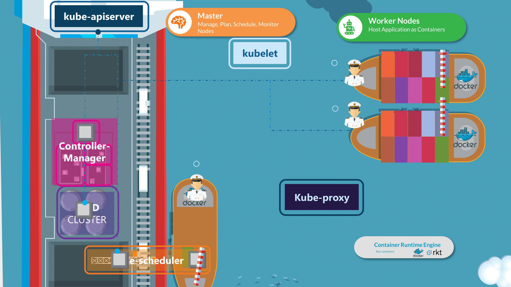
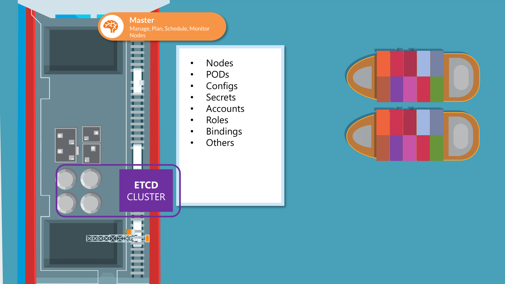
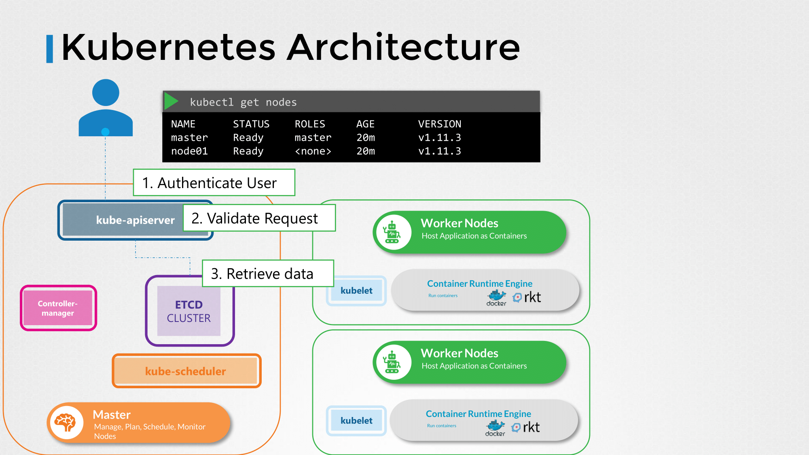
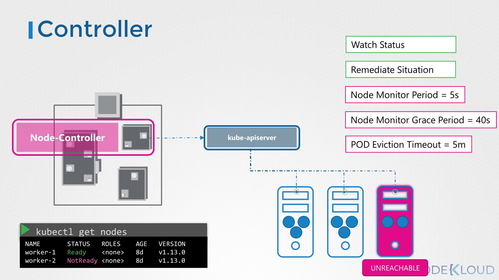
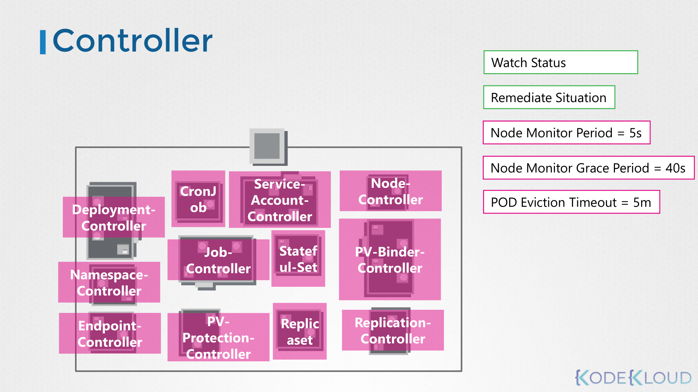
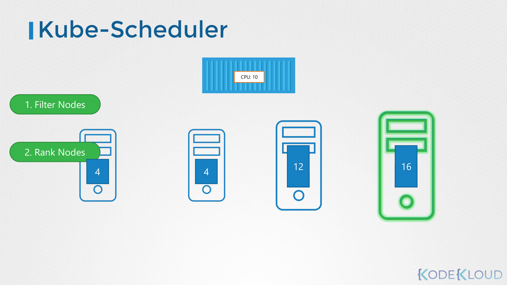

# Core Concepts
## Cluster Architecture
### 쿠버네티스의 목적
- 애플리케이션을 컨테이너 형식으로, 자동화된 방식으로 호스팅하는 것.
	- 요구에 따라 애플리케이션의 많은 인스턴스를 쉽게 배포할 수 있다.
	- 애플리케이션 내 다양한 서비스 간의 통신이 쉽게 가능하다.

### Kubernetes Cluster Architecture
- 쿠버네티스가 하는 역할은 크게 두 가지로 나뉜다. 배로 비유하자면:
	- Cargo Ships that Carries Containers.
	- Monitoring / Managing the Cargo Ships.



**노드**
> 쿠버네티스 클러스터는 위의 역할을 담당하기 위한 **노드**의 집합이다.

- **워커 노드**: 컨테이너를 Loading하기 위한 용도의 Cargo Ship.

- **마스터 노드**: 컨테이너를 올릴 Cargo Ship(Worker Node)을 관리하는 Control Ship.
	- 어떤 종류의 컨테이너를 올릴 것인지 정의한다.
	- 관리하고 있는 Ship의 정보를 저장한다.
	- 컨테이너의 상태를 모니터링하고 추적한다 (Manage the Whole Loading Process 등).

**컨트롤 플레인 컴포넌트**
> 마스터 노드는 위에 정의한 작업들을 수행하기 위해 **컨트롤 플레인 컴포넌트**라는 것을 사용한다.

- **etcd**: 언제, 어떤 컨테이너가 어떤 노드에 올라갔는 지를 저장하기 위한 키-값 저장소.
- **kube-scheduler**: 노드가 배정되지 않은 새로 생성된 파드를 감지하고, 실행할 노드를 선택한다.
	- resource requirement
	- 워커 노드의 capacity
	- 기타 policy / constraint 고려 (e.g. node-affinity rule)
- **kube-controller-manager**
	- **노드 컨트롤러**: 클러스터에 있는 노드를 관리한다.
		- 새 노드가 추가되거나, 사용 불가능하거나 파괴되는 상황을 처리한다.
	- **레플리케이션 컨트롤러**: 파드가 특정 개수만큼 복제되고 동작하는 것을 보장한다.
- **kube-apiserver**: 클러스터 내에서 모든 작업을 오케스트레이션한다.
	- 쿠버네티스 API를 노출하는 컨트롤 플레인 컴포넌트이다.

**노드 컴포넌트**
> **노드 컴포넌트**는 동작 중인 파드를 유지시키고 쿠버네티스 런타임 환경을 제공하며, 모든 노드 상에서 동작한다.

- **컨테이너 런타임**: 컨테이너 실행을 담당하는 소프트웨어이다 (e.g. Docker, containerd)
- **kubelet**: 클러스터의 각 노드에서 실행되는 에이전트이다.
	- kube-apiserver에서 오는 요청을 받아서 노드에 적용한다.
	- 주기적으로 kube-apiserver에서 노드와 컨테이너 상태를 모니터링하기 위해 상태 보고서를 가져온다.
- **kube-proxy**: 실행 중인 컨테이너 애플리케이션 간 통신을 담당한다.
	- 각 워커 노드에서 개별적으로 실행되는 서비스이다.

## ETCD in Kubernetes
### What is ETCD?
> A distributed, reliable key-value store that is simple, secure and fast.



- etcd 클러스터에 노드, 파드, 컨피그, 시크릿, 어카운트 등의 쿠버네티스 오브젝트 정보를 저장한다.
	- 값이 정상적으로 저장되거나 변경되면 task가 완전히 complete된 것으로 간주한다.
- `kubectl get` 명령어를 사용했을 때 etcd에 저장된 값을 리턴한다.
### key-value store
- 일반적인 테이블 형태로 저장하는 대신, configuration처럼 적은 용량을 빠르게 읽고 쓰기 위해 사용한다.

### ETCD 실행하기
```bash
./etcd
```
- 로컬에서 실행할 경우, 2379번 포트를 사용한다.

### 직접 설치할 경우
```bash
wget -q --https-only \
"https://github.com/coreos/etcd/releases/download/v3.3.9/etcd-v3.3.9-linux-amd64.tar.gz"
```
- `--advertise-client-urls` 옵션은 kube-apiserver에서 etcd 클러스터에 접근하기 위해 설정해주어야 하는 필드이다.

### kubeadm으로 설치할 경우
```bash
kubectl get pods -n kube-system
```
- kube-system이라는 네임스페이스에 파드 형태로 etcd server가 생성된다.
- 파드 내부의 컨테이너에서 `etcdctl` 명령어로 리소스 접근이 가능하다.

### Explore ETCD
- 파드 내부 디렉토리를 확인해보면 레지스트리 하위 경로에 여러 쿠버네티스 구성 요소가 존재한다.
	- minions
	- pods
	- replicasets
	- deployments
	- roles
	- secrets

### ETCD in HA Environment
- `etcd.service` 필드의 `--initial-cluster` 항목에 etcd server의 경로를 입력한다.

## Kube API Server
- `kubectl` 명령어를 실행하면 기본적으로 kube-apiserver로 요청이 전달된다.
- 또는 `kubectl` 대신 API를 직접 호출할 수 도 있다.



1. Authenticate User
2. Validate Request
3. Retrieve data
4. Update ETCD
5. Scheduler
6. Kubelet

- 다른 형태의 요청도 대부분 위와 같은 절차를 거쳐 이루어진다.
- 즉, 쿠버네티스에서 리소스와 오브젝트를 관리하는 주체는 kube-apiserver이다.
- etcd에 유일하게 직접 접근할 수 있다.
	- 쿠버네티스의 다른 오브젝트/리소스는 kube-apiserver를 통해 etcd에 접근해야 한다.

### kubeadm을 사용할 경우
- kubeadm을 사용할 경우 kube-apiserver를 직접 설치할 필요는 없지만, 바이너리 형태로 직접 설치할 수도 있다.
- kubeadm으로 설치했다면, 마스터 노드의 kube-system 네임스페이스에 kube-apiserver-master라는 이름의 파드가 생성된다.

### Kube API Server Options
- 파드를 정의한 yaml 파일은 아래 경로를 통해 확인할 수 있다.
	```bash
	cat /etc/kubernetes/manifests/kube-apiserver.yaml
	```
- kube-apiserver의 옵션은 아래 경로를 통해 확인할 수 있다.
	```bash
	cat /etc/systemd/system/kube-apiserver.service
	```
- 마스터 노드에서 실행 중인 프로세스 중 kube-apiserver에서 실행되는 것들은 아래 명령어로 확인할 수 있다.
	```bash
	ps -aux | grep kube-apiserver
	```

## Kube Controller Manager
- 쿠버네티스의 다양한 컨트롤러를 관리한다.
- 컨트롤러는 지속적으로 시스템 내 다양한 구성 요소의 상태를 모니터링하고, 시스템 전체를 원하는 기능 상태로 만든다.

### 노드 컨트롤러



- 노드 컨트롤러는 kube-apiserver를 통해 노드의 상태를 모니터링하고 애플리케이션이 계속 실행되도록 필요한 행동을 한다.

### 레플리케이션 컨트롤러


- 레플리케이션 컨트롤러는 레플리카셋의 상태를 모니터링하고 원하는 수의 파드가 항상 사용 가능하도록 한다.
- 파드가 죽으면 재생성한다.

### 쿠버네티스의 다양한 컨트롤러



- 쿠버네티스에서는 오브젝트를 관리하기 위해 여러 종류의 컨트롤러를 사용한다.
- 다양한 컨트롤러들은 kube-controller-manager라는 단일 프로세스로 관리된다.
- 즉, kube-controller-manager를 설치하면 다른 컨트롤러도 설치된다.

### Kube Controller Manager 설치하기
```bash
wget https://storage.googleapis.com/kubernetes-release/release/v1.13.0/bin/linux/amd64/kube-controller-manager
```
- `--controllers` 옵션으로 컨트롤러를 활성화할지 지정할 수 있다.
	- 기본값으로 설정하면 모든 종류의 컨트롤러를 전부 활성화된다.
	- 컨트롤러가 작동하지 않거나 존재하지 않을 경우, 해당 옵션을 살펴보면 된다.

### Kube Controller Manager Options
 - kubeadm으로 설치했다면, 파드를 정의한 yaml 파일은 아래 경로를 통해 확인할 수 있다.
	```bash
	cat /etc/kubernetes/manifests/kube-controller-manager.yaml
	```
- kubeadm 없이 직접 설치했다면, kube-controller-manager의 옵션은 아래 경로를 통해 확인할 수 있다.
	```bash
	cat /etc/systemd/system/kube-controller-manager.service
	```
- 현재 실행 중인 kube-controller-manager 프로세스는 아래 명령어로 확인할 수 있다.
	```bash
	ps -aux | grep kube-controller-manager
	```

## Kube Scheduler
- 어떤 파드가 어떤 노드에 위치할 것인가를 결정한다.
- 실제로 파드를 배치하지는 않는다.
- Filter Nodes/Rank Nodes 작업을 통해 파드를 설치할 수 있는 최적의 노드를 선정한다.



- 예시 그림의 CPU 요구량은 10이므로 CPU 4인 노드는 대상에서 제외된다.
- CPU를 할당한 후 남은 리소스가 많을 수록 가중치가 높다.
- 예시의 경우 CPU 16개가 있는 노드의 가중치가 더 높기 때문에 선택된다.
- High Level에서는 위와 같은 방식으로 작동하며, 사용자의 구성에 따라 값이 변할 수 있다.

### Kube Scheduler 설치하기
```bash
wget https://storage.googleapis.com/kubernetes-release/release/v1.13.0/bin/linux/amd64/kube-scheduler
```

### Kube Scheduler Options
 - kubeadm으로 설치했다면, 파드를 정의한 yaml 파일은 아래 경로를 통해 확인할 수 있다.
	```bash
	cat /etc/kubernetes/manifests/kube-scheduler.yaml
	```

- 현재 실행 중인 kube-scheduler 프로세스는 아래 명령어로 확인할 수 있다.
	```bash
	ps -aux | grep kube-scheduler
	```
