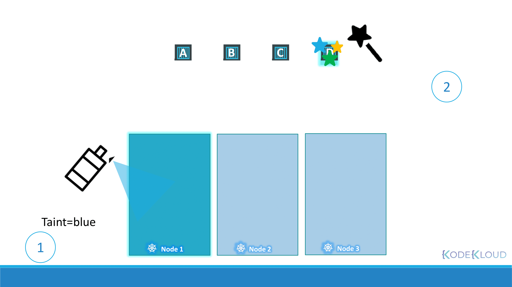

# Scheduling

## Manual Scheduling

### How scheduling works


```yaml
apiVersion: v1
kind: Pod
metadata:
  name: nginx
  labels:
    name: nginx
spec:
  containers:
    - name: nginx
      image: nginx
      ports:
        - containerPort: 8080
  nodeName: node02
```

- 일반적으로는 쿠버네티스가 nodeName 필드를 자동으로 추가한다.
- 스케쥴러는 모든 파드를 보며 nodeName 필드가 설정되지 않은 파드를 탐색한다.
- 이후 스케쥴링 알고리즘을 실행하여 파드에 적합한 노드를 식별한다.
- 식별되면 nodeName을 해당 노드의 이름으로 설정하여 노드에서 파드를 스케쥴에 예약한다.

### 스케쥴러가 없다면?

- 파드는 계속 Pending 상태가 된다.
- 스케쥴러 없이 수동으로 직접 파드를 노드에 할당할 수 있다.
  - 가장 쉬운 방법은 해당 파드의 매니페스트 파일에 nodeName 필드로 노드를 직접 지정해주는 것이다.
- 파드 생성 시에만 nodeName을 직접 지정할 수 있다.
  - 파드가 이미 생성된 경우, nodeName을 수정하는 것은 허용되지 않는다.
  - 이 경우에는 바인딩 오브젝트를 정의하고, 바인딩 API에 POST 요청을 요청을 보내면 된다.
    - yaml 파일은 json 형식으로 변환하여 POST 요청의 body에 담아야 한다.
    - 이는 스케쥴러가 하는 일을 매뉴얼하게 따라하는 것과 비슷하다.
    ```yaml
    apiVersion: v1
    kind: Binding
    metadata:
      name: nginx
    target:
      apiVersion: v1
      kind: Node
      name: node02
    ```

## Labels and Selectors

- 레이블과 셀렉터는 그룹화하는 표준 방법이다.

### 어떻게 사용될까?

- 쿠버네티스에서 파드, 서비스, 디플로이먼트 등 다양한 다른 타입의 리소스를 생성할 수 있다.
- 다양한 오브젝트 사이에서 효율적으로 원하는 오브젝트를 선택하기 위해서는 여러 카테고리에 따라 그룹화 해야 한다.
- 레이블과 셀렉터를 사용하여 그룹화되어 있는 오브젝트를 필요에 따라 구분지어 찾을 수 있다.

### 어떻게 사용할까?

- 매니페스트 파일에서 키-값 쌍으로 지정하면 된다.
- 아래 명령어는 app이 App1인 파드를 찾는 예시이다.
  ```bash
  kubectl get pods --selector app=App1
  ```

### 어떻게 작동할까?

- 레이블과 셀렉터는 내부적으로 다른 오브젝트를 함께 연결한다.

**주의**

- metadata 필드의 label과 template 하위 필드의 label을 혼동하면 안된다.
  - metadata.labels: 매니페스트 구성, kind 요소 자체의 레이블
  - template.metadata.labels: 파드의 레이블
- 예를 들어 레플리카셋을 생성할 때, 파드의 레이블과 레플리카셋의 셀렉터가 일치해야 정상적으로 오브젝트가 생성된다.

### Annotations

- 레이블과 셀렉터는 그룹화에 사용되지만, 어노테이션은 그 외 세부사항을 기록하는데 사용된다.

## Taints and Tolerations



- 테인트와 톨러레이션은 노드에서 스케쥴링 될 수 있는 파드를 제한할 때 사용한다.
- 노드와 파드가 제한이 없는 경우, 밸런싱되어 파드는 노드에 스케쥴링되어 할당된다.
- 특정 노드에 테인트를 추가하면, 일반적인 파드는 해당 노드에 할당될 수 없다.
- 파드에 노드의 테인트에 해당하는 톨러레이션을 추가하면, 해당 노드에 할당될 수 있다.
- 테인트 조건에 해당하지 않는 파드에 대한 옵션인 taint-effect는 세 가지가 있다:
  - NoSchedule: 테인트가 허용되지 않는 파드는 스케쥴링하지 않는다. 이미 실행 중인 파드는 관여하지 않는다.
  - PreferNoSchedule: 테인트가 허용되지 않는 파드는 스케쥴링하지 않으려고 한다. 하지만 클러스터 리소스가 부족한 상황 등에 대해서는 톨러레이션을 만족하지 않아도 노드에 스케쥴링된다.
  - NoExecute: 테인트가 허용되지 않는 파드는 스케쥴링하지 않는다. 이미 실행 중인 파드도 축출한다.

### How to use

- 아래 명령어를 통해 노드에 테인트를 적용할 수 있다.
  ```bash
  kubectl taint nodes node01 app=blue:taint-effect
  ```
- 아래 명령어를 통해 테인트를 확인할 수 있다.
  ```bash
  kubectl describe node node01 | grep Taint
  ```
- 톨러레이션은 아래와 같이 구성한다.
  ```yaml
  spec:
    containers:
      - name: nginx-container
        image: nginx
    tolerations:
      - key: "app"
        operator: "Equal"
        value: "bule"
        effect: "NoSchedule"
  ```
  - 톨러레이션과 관련된 모든 값은 큰따옴표로 묶어주어야 한다.

## Node Selectors

- 노드셀렉터는 파드의 nodeSelector 필드에 명시된 레이블을 가지고 있는 노드 중에 하나를 선택하여 스케쥴링할 수 있도록 하는 기능이다.

```yaml
apiVersion: v1
kind: Pod
metadata:
  name: myapp-pod
spec:
  containers:
    - name: data-processor
      image: data-processor
  nodeSelector:
    size: Large
```

- 노드에도 해당 키 값에 해당하는 레이블을 지정해주어야 한다. 아래 명령어를 통해 레이블을 지정할 수 있다.
  ```bash
  kubectl label nodes node01 size=Large
  ```

### 한계

- 노드셀렉터는 다음과 같은 한계를 가지고 있다. 레이블 small, medium, large을 가진 노드가 있다고 가정하자.
  - medium, large 값을 가진 노드만 선택하고 싶다면 어떡할까?
  - 같은 의미로, small이 아닌 노드만 선택하고 싶다면 어떡할까?
- 이러한 한계를 보완하기 위해 나온 것이 노드어피니티 기능이다.
