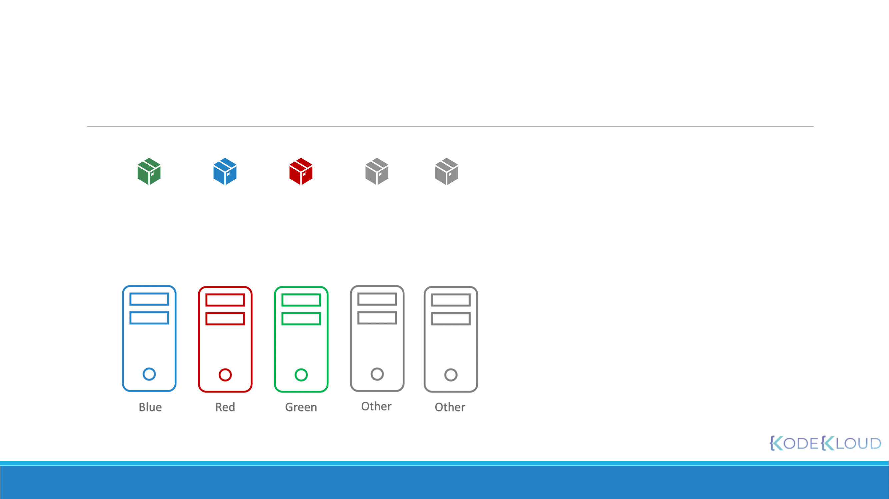
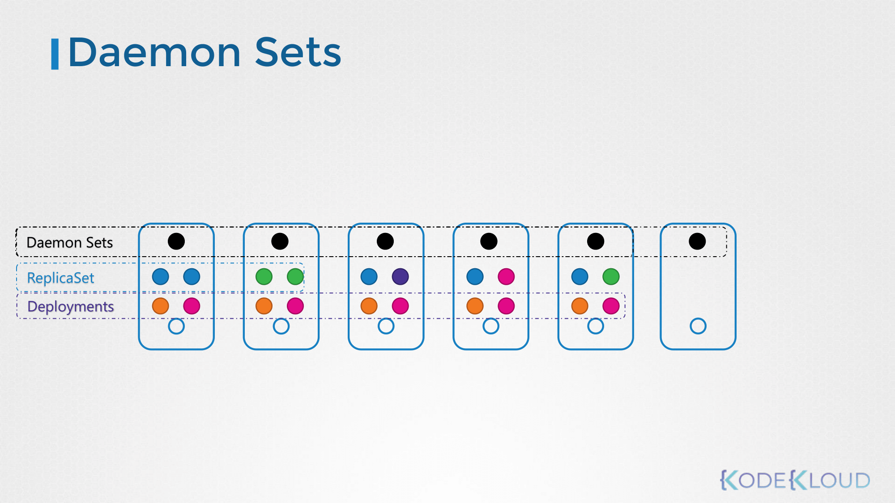
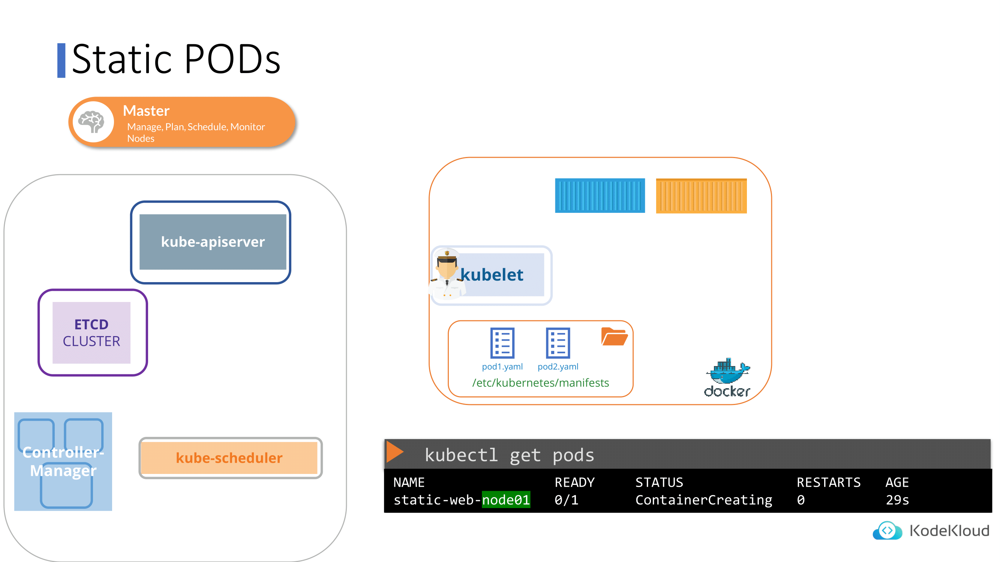

# Scheduling

[메인으로 돌아가기](../../README.md)

## Manual Scheduling

### How scheduling works


```yaml
apiVersion: v1
kind: Pod
metadata:
  name: nginx
  labels:
    name: nginx
spec:
  containers:
    - name: nginx
      image: nginx
      ports:
        - containerPort: 8080
  nodeName: node02
```

- 일반적으로는 쿠버네티스가 nodeName 필드를 자동으로 추가한다.
- 스케줄러는 모든 파드를 보며 nodeName 필드가 설정되지 않은 파드를 탐색한다.
- 이후 스케줄링 알고리즘을 실행하여 파드에 적합한 노드를 식별한다.
- 식별되면 nodeName을 해당 노드의 이름으로 설정하여 노드에서 파드를 스케줄에 예약한다.

### 스케줄러가 없다면?

- 파드는 계속 Pending 상태가 된다.
- 스케줄러 없이 수동으로 직접 파드를 노드에 할당할 수 있다.
  - 가장 쉬운 방법은 해당 파드의 매니페스트 파일에 nodeName 필드로 노드를 직접 지정해주는 것이다.
- 파드 생성 시에만 nodeName을 직접 지정할 수 있다.
  - 파드가 이미 생성된 경우, nodeName을 수정하는 것은 허용되지 않는다.
  - 이 경우에는 바인딩 오브젝트를 정의하고, 바인딩 API에 POST 요청을 요청을 보내면 된다.
    - yaml 파일은 json 형식으로 변환하여 POST 요청의 body에 담아야 한다.
    - 이는 스케줄러가 하는 일을 매뉴얼하게 따라하는 것과 비슷하다.
    ```yaml
    apiVersion: v1
    kind: Binding
    metadata:
      name: nginx
    target:
      apiVersion: v1
      kind: Node
      name: node02
    ```

## Labels and Selectors

- 레이블과 셀렉터는 그룹화하는 표준 방법이다.

### 어떻게 사용될까?

- 쿠버네티스에서 파드, 서비스, 디플로이먼트 등 다양한 다른 타입의 리소스를 생성할 수 있다.
- 다양한 오브젝트 사이에서 효율적으로 원하는 오브젝트를 선택하기 위해서는 여러 카테고리에 따라 그룹화 해야 한다.
- 레이블과 셀렉터를 사용하여 그룹화되어 있는 오브젝트를 필요에 따라 구분지어 찾을 수 있다.

### 어떻게 사용할까?

- 매니페스트 파일에서 키-값 쌍으로 지정하면 된다.
- 아래 명령어는 app이 App1인 파드를 찾는 예시이다.
  ```bash
  kubectl get pods --selector app=App1
  ```

### 어떻게 작동할까?

- 레이블과 셀렉터는 내부적으로 다른 오브젝트를 함께 연결한다.

**주의**

- metadata 필드의 label과 template 하위 필드의 label을 혼동하면 안된다.
  - metadata.labels: 매니페스트 구성, kind 요소 자체의 레이블
  - template.metadata.labels: 파드의 레이블
- 예를 들어 레플리카셋을 생성할 때, 파드의 레이블과 레플리카셋의 셀렉터가 일치해야 정상적으로 오브젝트가 생성된다.

### Annotations

- 레이블과 셀렉터는 그룹화에 사용되지만, 어노테이션은 그 외 세부사항을 기록하는데 사용된다.

## Taints and Tolerations


- 테인트와 톨러레이션은 노드에서 스케줄링 될 수 있는 파드를 제한할 때 사용한다.
- 노드와 파드가 제한이 없는 경우, 밸런싱되어 파드는 노드에 스케줄링되어 할당된다.
- 특정 노드에 테인트를 추가하면, 일반적인 파드는 해당 노드에 할당될 수 없다.
- 파드에 노드의 테인트에 해당하는 톨러레이션을 추가하면, 해당 노드에 할당될 수 있다.
- 테인트 조건에 해당하지 않는 파드에 대한 옵션인 taint-effect는 세 가지가 있다:
  - NoSchedule: 테인트가 허용되지 않는 파드는 스케줄링하지 않는다. 이미 실행 중인 파드는 관여하지 않는다.
  - PreferNoSchedule: 테인트가 허용되지 않는 파드는 스케줄링하지 않으려고 한다. 하지만 클러스터 리소스가 부족한 상황 등에 대해서는 톨러레이션을 만족하지 않아도 노드에 스케줄링된다.
  - NoExecute: 테인트가 허용되지 않는 파드는 스케줄링하지 않는다. 이미 실행 중인 파드도 축출한다.

### How to use

- 아래 명령어를 통해 노드에 테인트를 적용할 수 있다.
  ```bash
  kubectl taint nodes node01 app=blue:taint-effect
  ```
- 아래 명령어를 통해 테인트를 확인할 수 있다.
  ```bash
  kubectl describe node node01 | grep Taint
  ```
- 톨러레이션은 아래와 같이 구성한다.
  ```yaml
  spec:
    containers:
      - name: nginx-container
        image: nginx
    tolerations:
      - key: "app"
        operator: "Equal"
        value: "bule"
        effect: "NoSchedule"
  ```
  - 톨러레이션과 관련된 모든 값은 큰따옴표로 묶어주어야 한다.

## Node Selectors

- 노드셀렉터는 파드의 nodeSelector 필드에 명시된 레이블을 가지고 있는 노드 중에 하나를 선택하여 스케줄링할 수 있도록 하는 기능이다.

```yaml
apiVersion: v1
kind: Pod
metadata:
  name: myapp-pod
spec:
  containers:
    - name: data-processor
      image: data-processor
  nodeSelector:
    size: Large
```

- 노드에도 해당 키 값에 해당하는 레이블을 지정해주어야 한다. 아래 명령어를 통해 레이블을 지정할 수 있다.
  ```bash
  kubectl label nodes node01 size=Large
  ```

### 한계

- 노드셀렉터는 다음과 같은 한계를 가지고 있다. 레이블 small, medium, large을 가진 노드가 있다고 가정하자.
  - medium, large 값을 가진 노드만 선택하고 싶다면 어떡할까?
  - 같은 의미로, small이 아닌 노드만 선택하고 싶다면 어떡할까?
- 이러한 한계를 보완하기 위해 나온 것이 노드어피니티 기능이다.

## Node Affinity

- 노드어피니티는 특정 노드에 파드를 확실하게 할당하기 위한 기능이다.

```yaml
apiVersion: v1
kind: Pod
metadata:
  name: myapp-pod
spec:
  containers:
    - name: data-processor
      image: data-processor
  affinity:
    nodeAffinity:
      requiredDuringSchedulingIgnoredDuringExecution:
        nodeSelectorTerms:
          - matchExpressions:
              - key: size
                operator: In
                values:
                  - Large
                  - Medium
```

### Node Affinity Types

**Available**

- requiredDuringSchedulingIgnoredDuringExecution: 규칙이 만족되지 않으면 스케줄러가 파드를 스케줄링할 수 없다.
- preferredDuringSchedulingIgnoredDuringExecution: 스케줄러는 조건을 만족하는 노드를 찾으려고 노력한다. 해당되는 노드가 없더라도, 스케줄러는 여전히 파드를 스케줄링한다.

**Planned**

- requiredDuringSchedulingRequiredDuringExecution: 규칙이 만족되지 않으면 스케줄러가 파드를 스케줄링할 수 없다. 또한 실행 중에 레이블이 변경되어 규칙에 만족되지 않으면
  파드는 축출된다.

## Node Affinity vs Taints and Tolerations



- 테인트와 톨러레이션으로 물리적으로 완전히 노드를 분리할 수는 없다. 예를 들어 blue, red, green으로 테인트한 노드가 있고, 테인트가 없는 노드가 두 개 있다. 파드 또한 각 blue, red,
  green의 톨러레이션을 추가한 파드가 있다.
- 이때 blue로 톨러레이션된 파드가 blue로 테인트한 노드에만 스케줄링된다고 보장할 수 있는가? 그렇지 않다. 테인트가 존재하지 않는 노드에도 스케줄링 될 수 있다.
- 두 번째 상황으로, blue, red, green의 레이블을 추가한 노드가 있으며 각 파드에도 노드어피니티를 사용하여 노드가 스케줄링되도록 적용한 상황이다. 이 상황에서의 문제는 어떠한 노드어피니티도 추가하지
  않은 파드가 레이블이 적용된 노드에 스케줄링 될 수 있다는 문제가 있다.
- 따라서 테인트/톨러레이션과 노드어피니티를 조합해서 사용해야 완전한 물리적 노드 분리가 가능해진다.

## Resource Requirements and Limits

- 각 노드마다 할당된 자원이 있다(e.g. CPU, 메모리, 디스크).
- 쿠버네티스 스케줄러에 의해 각 노드의 자원 상황에 맞게 파드가 할당된다.
- 그런데 어떠한 노드도 추가적인 파드를 감당할 자원이 부족한 상황이 발생하면 어떻게 될까?
- 쿠버네티스는 해당 파드를 스케줄링하는 것을 보류한다. 그리고 해당 파드는 Pending 상태가 된다.

### Resource

- 쿠버네티스는 기본값으로 파드에 0.5CPU, 256Mi 메모리를 할당한다.
- 이는 노드에 파드를 할당할 때 컨테이너에 의해 요청된 최소의 CPU/메모리의 양이다. 이 숫자로 파드를 할당할 충분한 리소스 여유가 있는지 판단한다.
- resources.requests.cpu와 resources.requests.memory 필드로 설정 가능하다.
  ```yaml
  resources:
    requests:
      memory: "1Gi"
      cpu: 1
  ```

### Limit

- 한정된 자원을 설정할 수 있다.
  ```yaml
  resources:
    limits:
      memory: "2Gi"
      cpu: 2
  ```

### 초과하려고 하면?

- 만약 제한된 자원을 실행 중에 초과하려고 하면 어떻게 할까?
- CPU의 경우 쿠버네티스가 지정된 제한을 초과하지 않도록 조절한다.
  - 컨테이너는 제한된 CPU보다 많은 자원을 사용할 수 없기 때문이다.
- 메모리의 경우 다르다. 지정된 제한을 초과할 수 있다.
  - 컨테이너가 지정된 메모리보다 더 많은 메모리 자원을 사용할 수 있기 때문이다.
  - 하지만 파드가 지속적으로 제한된 자원보다 많은 메모리를 사용하려고 하면 파드는 Out Of Memory 에러가 발생하며 종료된다.

### LimitRange

- 기본값으로 정해진 자원을 선택하기 위해서는 해당 네임스페이스에서 리밋레인지라는 리소스를 사전에 정의해야 한다.

```yaml
apiVersion: v1
kind: LimitRange
metadata:
  name: cpu-resource-constraint
spec:
  limits:
    - default:
        cpu: 500m
      defaultRequest:
        cpu: 500m
      max:
        cpu: "1"
      min:
        cpu: 100m
      type: Container
```

```yaml
apiVersion: v1
kind: LimitRange
metadata:
  name: memory-resource-constraint
spec:
  limits:
    - default:
        memory: 1Gi
      defaultRequest:
        memory: 1Gi
      max:
        memory: 1Gi
      min:
        memory: 500Mi
      type: Container
```

## DaemonSets



- 데몬셋은 여러 파드를 배포하는데 도움을 주기 때문에 레플리카셋과 비슷하다.
- 하지만 데몬셋은 각 파드가 배포되어 있는 노드 하나 당 하나만 추가한다.
- 즉, 데몬셋은 클러스터의 모든 노드에 항상 하나의 파드 복사본이 존재하도록 한다.
- 데몬셋은 모니터링 솔루션과 로그 뷰어에 아주 적합하다.
- 노드가 새로 생성되거나 삭제될 때 데몬셋의 파드 역시 생성 또는 삭제된다.

```yaml
apiVersion: apps/v1
kind: DaemonSet
metadata:
  name: monitoring-daemon
spec:
  selector:
    matchLabels:
      app: monitoring-agent
  template:
    metadata:
      labels:
        app: monitoring-agent
    spec:
      containers:
        - name: monitoring-agent
          image: monitoring-agent
```

### Commands

- 아래 명령어를 통해 데몬셋을 확인할 수 있다.
  ```bash
  kubectl get daemonsets
  ```
- 자세한 내용을 살펴보려면 `kubectl describe` 명령어를 사용한다.
  ```bash
  kubectl describe daemonsets monitoring-daemon
  ```
- `kubectl create` 명령어를 통해 디플로이먼트에 대한 yaml 파일을 생성하고 kind 필드를 DaemonSet으로 변경하면 쉽게 작성할 수 있다.
  ```bash
  kubectl create deployment elasticsearch --image=registry.k8s.io/fluentd-elasticsearch:1.20 -n kube-system --dry-run=client -o yaml > fluentd.yaml
  vim fluentd.yaml
  ```

## Static Pods



- 마스터 노드의 kube-apiserver와 워커 노드의 kubelet이 통신을 한다는 것을 알고 있다. 그렇다면 마스터 노드의 모든 리소스가 없는 상태라면 워커 노드는 스스로 작동할 수 있을까? kubelet만
  있다면 할 수 있다. 이것이 스태틱 파드이다.
- 하지만 매니페스트 파일과 통신할 kube-apiserver도 없는데 kubelet 혼자서 어떻게 생성할까?
  - `etc/kubernetes/manifests`에서 파드 정의 파일을 읽도록 kubelet을 구성할 수 있다.
- kubelet은 주기적으로 해당 디렉토리의 파일을 읽으며 호스트에 파드를 생성한다.
- 생성 뿐만 아니라 활성 상태로 만든다. 파드 충돌이 발생하면 kubelet은 충돌한 파드를 다시 시작할 수도 있다.
- 이 디렉토리의 파일에 변경이 발생하면 kubelet은 이 변경 사항을 적용하여 파드를 재생성한다.
- 이 디렉토리의 파일이 삭제되면 파드도 자동으로 삭제된다.
- 오직 파드만 생성 가능하다는 것에 주의하자.

### 어디서 쓰는데?

- 마스터 노드에서 컨트롤 플레인 역할을 하는 파드를 스태틱 파드를 통해 생성할 수 있다.

## Multiple Schedulers

- 스케줄러도 한 개 이상 생성할 수 있다. 왜 한 개 이상의 생성이 필요할까?
  - 이전에 테인트/톨러레이션, 노드어피니티, 노드셀렉터를 통해 스케줄러가 특정 노드에 특정 파드를 생성하도록 했다.
  - 그런데 복합적인 절차들이 맞물려서 여러 개의 스케줄 조건이 필요할 수 있다.
  - 쿠버네티스에서는 다중 스케줄러를 지원한다.

### 커스텀 스케줄러 배포하기

```bash
wget https://storage.googleapis.com/kubernetes-release/release/v1.27.0/bin/linux/amd64/kube-scheduler
```

- `--scheduler-name` 옵션을 변경한다.
- schedulerName 필드가 파드 생성 시 스케줄러를 선택하는 키 값이 된다.

### Kubeadm으로 커스텀 스케줄러 배포하기

```yaml
apiVersion: v1
kind: Pod
metadata:
  name: my-custom-scheduler
  namespace: kube-system
spec:
  containers:
    - command:
        - kube-scheduler
        - --address=127.0.0.1
        - --kubeconfig=/etc/kubernetes/scheduler.conf
        - --leader-elect=true
      image: k8s.gcr.io/kube-scheduler-amd64:v1.11.3
      name: kube-scheduler
```

- 마찬가지로, `--scheduler-name` 옵션을 변경한다.
- `--leader-elect` 은 여러 개의 스케줄러가 마스터 노드에 있다고 할 때, 어떤 스케줄러가 실행될 것인지 결정하는 옵션이다.
  - 마스터 노드가 하나만 있는 상황에서 스케줄러가 여러 개라면, 하나를 뺀 나머지는 false 옵션을 줘야 한다.
  - 고가용성을 위해 다중 마스터 노드를 구성할 경우, `--lock-object-name` 옵션에 스케줄러 이름을 추가해야 한다.

### 커스텀 스케줄러 사용하기

- 정상적으로 배포가 완료되었다면, 아래 명령어를 통해 스케줄러를 확인할 수 있다.
  ```bash
  kubectl get events
  ```
- 파드 생성 시 schedulerName 필드에 스케줄러 파드의 이름을 명시하면, 해당 스케줄러를 통해 배포할 수 있다.
- 만약 스케줄러에 오류가 있을 경우 요청한 파드는 Pending 상태가 된다.
- 로그는 아래 명령어를 통해 확인할 수 있다.
  ```bash
  kubectl logs my-custom-scheduler --name-space=kube-system 
  ```
