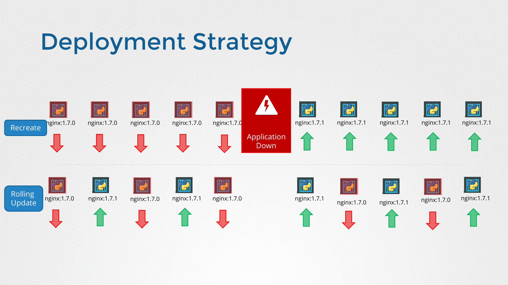
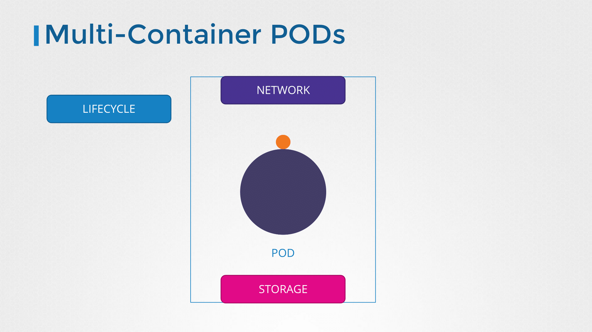

# Application Lifecycle Management

## Rolling Updates and Rollbacks

- 디플로이먼트가 처음 생성되면, 롤아웃이 트리거된다.
- 새로운 롤아웃은 새로운 디플로이먼트의 리비전을 생성한다.
- 리비전은 디플로이먼트가 변경사항을 추적하고자 할 때와 이전 버전으로 롤백하고자 할 때 도움을 준다.
- 두 개의 리비전이 유지되고 있기 때문에 새로운 버전으로 롤아웃/이전 버전으로 롤백하는 것이 가능하다

### 배포 전략



**Recreate**

- 기존 배포된 애플리케이션을 모두 삭제하고, 새 버전의 애플리케이션을 다시 생성한다.
- 삭제 후 새 버전을 생성하는 사이에 다운타임이 발생할 수 있다.
- 쿠버네티스의 기본 배포 전략이 아니다.

**Rolling Update**

- 하나씩 이전 버전을 종료하고 새로운 버전을 배포하는 방식이다.
- 어플리케이션 다운타임이 발생하지 않고 원활하게 새 버전을 배포할 수 있다.
- 쿠버네티스의 기본 배포 전략에 해당한다.

### Updates

- 매니페스트 파일의 변경 이후, `kubectl apply` 명령어를 통해 업데이트를 적용할 수 있다. 이를 통해 디플로이먼트의 새로운 리비전이 생성된다.
- `kubectl set image` 명령어를 통해 애플리케이션 이미지 업데이트를 진행할 수 있다. 이 방식은 yaml 파일 내 애플리케이션 이미지 버전을 변경하지는 않는다.
  ```bash
  kubectl set image deployment frontend simple-webapp=kodecloud/webapp-color:v2
  ```

### Commands

- 아래 명령어를 통해 롤아웃 상태를 확인할 수 있다.
  ```bash
  kubectl rollout status deployment/myapp-deploy
  ```
  - 아래 명령어를 통해 롤아웃의 기록을 확인할 수 있다.
  ```bash
  kubectl rollout history deployment/myapp-deploy
  ```
- 아래 명령어를 통해 이전 버전으로 롤백할 수 있다.
  ```bash
  kubectl rollout undo deployment/myapp-deploy
  ```

## Commands and Arguments

- Dockerfile의 ENTRYPOINT는 쿠버네티스의 command 필드와 대응되며, CMD는 쿠버네티스의 args 필드와 대응된다.

```dockerfile
FROM Ubuntu

ENTRYPOINT [ "sleep" ]

CMD [ "5" ]
```

```yaml
apiVersion: v1
kind: Pod
metadata:
  name: ubuntu-sleeper-pod
spec:
  containers:
    - name: ubuntu-sleeper
      image: ubuntu-sleeper
      command: [ "sleep2.0" ]
      args: [ "10" ]
```

## Configure Environment Variables in Applications

- 쿠버네티스에서 환경변수를 설정하는 방법은 다음과 같다.
  ```yaml
  env:
    - name: APP_COLOR
      value: pink
  ```
- 컨피그맵을 통해 환경변수를 설정하는 방법은 다음과 같다.
  ```yaml
  env:
    - name: APP_COLOR
      valueFrom:
        configMapKeyRef:
  ```
- 시크릿을 통해 환경변수를 설정하는 방법은 다음과 같다.
  ```yaml
  env:
    - name: APP_COLOR
      valueFrom:
        secretKeyRef:
  ```

## Configuring ConfigMaps in Applications

- 환경변수를 파드 매니페스트 파일에 정의할 수 있지만, 환경변수를 각 파드별로 관리하는 것보다 컨피그맵을 통해 하나의 파일에서 모든 환경변수를 관리하는 것이 효율적이다.

### Create ConfigMaps

- `--from-literal` 옵션을 사용하여 명령형 방식으로 컨피그맵을 생성할 수 있다.
  ```bash
  kubectl create configmap \
    app-config --from-literal=APP_COLOR=blue \
               --from-literal=APP_MODE=prod
  ```
- 또는 `--from-file` 옵션을 통해 해당 파일을 읽어 컨피그맵을 생성할 수 있다.
  ```bash
  kubectl create configmap \
    app-config --from-file=app_config.properties
  ```
- 아래와 같이 선언형으로 컨피그맵을 생성할 수 있다.
  ```yaml
  apiVersion: v1
  kind: ConfigMap
  metadata:
    name: app-config
  data:
    APP_COLOR: "blue"
    APP_MODE: "prod"
  ```

### View ConfigMaps

- 아래 명령어를 통해 생성된 컨피그맵을 조회할 수 있다.
  ```bash
  kubectl get configmaps
  ```
- 아래 명령어를 통해 생성된 컨피그맵의 정보를 확인할 수 있다.
  ```bash
  kubectl describe configmaps
  ```

### ConfigMap in Pods

- 아래와 같이 envFrom.configMapRef 필드에 생성된 컨피그맵 이름을 지정할 수 있다.
  ```yaml
  envFrom:
    - configMapRef:
      name: app-config
  ```
- 단일 환경변수로 주입하려면 env.valueFrom.configMapKeyRef 필드에 생성된 컨피그맵 이름을 지정하고, 환경변수 이름을 key로 지정한다.
  ```yaml
  env:
    - name: APP_COLOR
      valueFrom:
        configMapKeyRef:
          name: app-config
          key: APP_COLOR
  ```
- 또는 볼륨에 컨피그맵을 마운트할 수 있다.
  ```yaml
  volumes:
    - name: app-config-volume
      configMap:
        name: app-config
  ```

## Configure Secrets in Applications

- 컨피그맵은 문자열 그대로 저장하기 때문에 민감한 정보를 저장할 때는 적절하지 않다.
- 시크릿을 사용하면 해당 정보가 인코딩 또는 해시 상태로 저장되기 때문에 보안을 강화할 수 있다.

### Create Secrets

- `--from-literal` 옵션을 사용하여 명령형 방식으로 시크릿을 생성할 수 있다.
  ```bash
  kubectl create secret generic \
    app-secret --from-literal=DB_HOST=mysql \
               --from-literal=DB_USER=root \
               --from-literal=DB_PASSWORD=paswrd
  ```
- 또는 `--from-file` 옵션을 통해 해당 파일을 읽어 시크릿을 생성할 수 있다.
  ```bash
  kubectl create secret generic \
    app-config --from-file=app_secret.properties
  ```
- 아래와 같이 선언형으로 시크릿을 생성할 수 있다. 이때 인코딩된 형식으로 데이터를 지정해야 한다.
  ```yaml
  apiVersion: v1
  kind: Secret
  metadata:
    name: app-secret
  data:
    DB_HOST: "bXlzcWw="
    DB_USER: "cm9vda=="
    DB_PASSWORD: "cGFzd3Jk"
  ```
- 아래 명령어를 통해 일반 문자열에서 인코딩된 형식으로 변환할 수 있다.
  ```bash
  echo -n 'mysql' | base64
  ```

### View Secrets

- 아래 명령어를 통해 생성된 시크릿을 조회할 수 있다.
  ```bash
  kubectl get secrets
  ```
- 아래 명령어를 통해 생성된 시크릿의 정보를 확인할 수 있다. 이때 값은 숨김 처리된다.
  ```bash
  kubectl describe secrets
  ```
- 아래 명령어를 통해 시크릿의 값을 조회할 수 있다.
  ```bash
  kubectl get secret app-secret -o yaml
  ```
- 아래 명령어를 통해 인코딩된 데이터를 디코딩할 수 있다.
  ```bash
  echo -n 'bXlzcWw=' | base64 --decode
  ```

### Secrets in Pods

- 아래와 같이 envFrom.secretRef 필드에 생성된 시크릿 이름을 지정할 수 있다.
  ```yaml
  envFrom:
    - secretRef:
      name: app-secret
  ```
- 단일 환경변수로 주입하려면 env.valueFrom.secretKeyRef 필드에 생성된 시크릿 이름을 지정하고, 환경변수 이름을 key로 지정한다.
  ```yaml
  env:
    - name: DB_PASSWORD
      valueFrom:
        secretKeyRef:
          name: app-secret
          key: DB_PASSWORD
  ```
- 또는 볼륨에 시크릿을 마운트할 수 있다.
  ```yaml
  volumes:
    - name: app-secret-volume
      secret:
        secretName: app-secret
  ```

## Multi Container Pods

- 마이크로서비스 아키텍쳐가 등장하면서 각 서비스를 스케일 업/다운하는 작업이 수월해졌다.
- 하지만 마이크로서비스임에도 불구하고 특정 서비스의 경우 같이 써야 효과적인 경우가 있다(e.g. 애플리케이션과 로깅 서비스).



- 같은 네트워크를 사용하므로 서로 로컬호스트처럼 접근이 가능하다.
- 동일한 스토리지 볼륨을 공유한다.

### Create

- spec.containers 필드에 여러 컨테이너를 명시하면 된다.
  ```yaml
  apiVersion: v1
  kind: Pod
  metadata:
    name: simple-webapp
    labels:
      name: simple-webapp
  spec:
    containers:
      - name: simple-webapp
        image: simple-webapp
        ports:
          - containerPort: 8080
      - name: log-agent
        image: log-agent
  ```

## Init Containers

```yaml
apiVersion: v1
kind: Pod
metadata:
  name: myapp-pod
  labels:
    app: myapp
spec:
  containers:
    - name: myapp-container
      image: busybox:1.28
      command: [ 'sh', '-c', 'echo The app is running! && sleep 3600' ]
  initContainers:
    - name: init-myservice
      image: busybox
      command: [ 'sh', '-c', 'git clone <some-repository-that-will-be-used-by-application>; done;' ]
```

- 파드 컨테이너가 실행될 때, 메인 프로세스 컨테이너 실행 전에 선행 작업이 필요한 경우(e.g. 원격 저장소로부터 소스코드나 바이너리 파일을 받아 메인 애플리케이션에 사용하고자 할 경우) 초기화 컨테이너를
  사용한다.
- 파드가 실행될 때 초기화 컨테이너가 먼저 실행된다.
- 애플리케이션 컨테이너가 실행되기 전에 초기화 컨테이너의 실행이 완료되어야 한다.
- 초기화 컨테이너는 여러 개 정의할 수 있고, 순차적으로 실행된다.
- 초기화 컨테이너가 실패하면 성공할 때까지 파드를 재실행한다.
