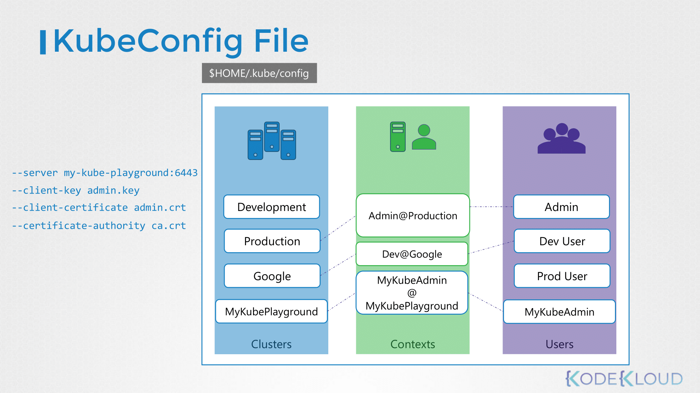

# Security

## Security Primitives

- 호스트에 대한 모든 액세스는 보안되어야 한다.
- 루트 액세스는 비활성화되어야 하며, 암호 기반 인증도 비활성화되어야 한다.
- 오직 SSH Key를 기반으로 한 인증만 사용할 수 있다.
- kube-apiserver는 쿠버네티스의 모든 동작의 중심으로, api에 직접 접근하거나 kubectl을 통해 상호작용하게 된다.
- 첫 번째 방어선인 kube-apiserver에 대한 접근을 어떻게 제어할 수 있을까? 아래의 두 가지로 결정해야 한다:
  - 누가 클러스터에 접근할 수 있는가?
  - 무엇을 할 수 있을까?

### Who can access?

- 인증 메커니즘에 의해 결정된다. 여러 가지 방법이 존재한다.
  - Files - Username and Passwords
  - Files - Username and Tokens
  - Certificates
  - External Authentication providers - LDAP
  - Service Accounts

### What can they do?

- RBAC Authorization - Role Based Access Control
- ABAC Authorization - Attribute Based Access Control
- Node Authorization
- Webhook Mode
- etcd 클러스터, kube-controller-manager, kube-scheduler, kube-apiserver 와 같은 다양한 구성 요소 사이의 모든 통신은 TLS Encryption 에 의해 보호된다.
- 클러스터 내의 애플리케이션 간의 통신은 네트워크 폴리시에 의해 제한된다.

## Authentication

- 쿠버네티스는 사용자 계정을 관리하지 않고 사용자를 관리하기 위해 외부 소스(파일, 인증서, LDAP 등)에 의존한다.
- 사용자를 제외한 서비스어카운트의 경우 생성하고 관리할 수 있다.
- 아래 명령어를 통해 서비스어카운트를 생성할 수 있다.
  ```bash
  kubectl create serviceaccount sa1
  ```

### Static Password File (Deprecated in 1.19)

- 사용자와 비밀번호의 리스트를 담은 csv 파일을 생성하고 사용할 수 있다.
- 해당 csv 파일에는 user, userID, password 세 개의 컬럼이 있다.
- `--basic-auth-file` 옵션에 파일 경로를 지정하여 사용할 수 있다.
- kubeadm을 사용한다면 kube-apiserver의 스태틱 파드에 `--basic-auth-file` 옵션을 추가한다.

### Static Token File

- 비밀번호 대신 토큰을 csv 파일에 저장하는 방식이다.
- `--token-auth-file` 옵션에 파일 경로를 지정하여 사용할 수 있다.
- kubeadm을 사용한다면 kube-apiserver의 스태틱 파드에 `--token-auth-file` 옵션을 추가한다.

## TLS Certification

- 쿠버네티스 클러스터는 마스터 노드와 워커 노드로 구성되어 있다.
- 노드들 간의 모든 통신은 보안이 필요하고 반드시 암호화되어야 한다.


- 쿠버네티스에는 각 리소스 간의 안전한 통신을 위해서 키 쌍이 존재하며, 각 증명은 CA에 서명된 증명이어야 한다.

## Certificate Creation

- 인증서를 생성할 수 있는 많은 도구가 있지만, 여기서는 OpenSSL을 사용하여 생성하는 것을 알아보자.

### Root Certificate

- 아래 명령어를 통해 개인키를 생성한다.
  ```bash
  openssl genrsa -out ca.key 2048
  ```
- 아래 명령어를 통해 Certificate Signing Request (CSR)을 할 수 있다. 아직 서명이 되지 않은 상태이다.
  ```bash
  openssl req -new -key ca.key -subj "/CN=KUBERNETES-CA" -out ca.csr
  ```
- 앞에서 만든 ca.crt와 ca.key를 통해 인증서에 서명한다.
  ```bash
  openssl x509 -req -in ca.csr -signkey ca.key -out ca.crt
  ```

### Client Certificate

- admin 생성 과정과 kube-scheduler, kube-controller-manager, kube-proxy의 생성 과정은 동일하다.
- admin user를 위한 인증서 생성은 다음과 같다:
  - 아래 명령어를 통해 개인키를 생성한다.
    ```bash
    openssl genrsa -out admin.key 2048
    ```
  - 아래 명령어를 통해 Certificate Signing Request (CSR)을 할 수 있다. 사용자 이름(kube-admin)을 명시해야 한다.
    ```bash
    openssl req -new -key admin.key -subj "/CN=kube-admin" -out admin.csr
    ```
  - 앞에서 만든 ca.crt와 ca.key를 통해 인증서에 서명한다.
     ```bash
     openssl x509 -req -in ca.csr -signkey ca.key -out ca.crt
     ```
- 위의 과정은 새로운 사용자에 대해 새 계정을 만드는 과정과 유사하다. 그렇다면 다른 사용자와 admin은 어떻게 구분할까?
  - 인증서에 그룹 정보를 추가할 수 있다.
  - 쿠버네티스의 system masters 그룹이 관리자 권한을 가진다.
  - CSR 생성 시 아래와 같이 그룹을 명시한다.
    ```bash
    openssl req -new key admin.key -subj "/CN=kube-admin/O=system:masters" -out admin.csr
    ```

### Server Certificate

- 인증서 생성 과정은 위와 동일하다.

**ETCD Server Certificate**

- etcd 서버는 고가용성을 위해 클러스터 내 여러 서버에 배포될 수 있다.
  - 각 멤버들 간의 통신을 보호하기 위해 추가적인 피어 인증서를 생성해야 한다.
  - 인증서가 한 번 생성되면 etcd 서버를 시작할 때, 이를 명시해주어야 한다.

**kube-apiserver Certificate**

- kube-apiserver는 많은 요청이 들어오고, 많은 운영이 kube-apiserver를 통해 이루어지는 만큼 별칭이 많다.
- 별칭은 아래의 방법으로 지정할 수 있다.
  - openssl.cnf를 생성한다.
  - 이후, alt_names에 대체 DNS 또는 IP를 지정한다.
- 이후, 인증서에 서명한다.
  ```bash
  openssl x509 -req -in apiserver.csr -CA ca.crt -CAkey ca.key -out apiserver.crt
  ```

**kubelet Certificate**

- 노드마다 kubelet이 존재하기 때문에, 각 노드에 인증서가 필요하다. 이름은 노드에 따라서 정해진다.
- 인증서를 생성하고, kubelet-config 파일에 해당 정보를 알려준다. 이 과정은 각 노드에서 수행되어야 한다.
- kubelet은 클라이언트로서 kube-apiserver와 통신하기 위한 클라이언트 인증서도 필요하다.
  - kube-apiserver가 어떤 노드인지 알 수 있도록 이름이 지정된다.
  - 노드는 시스템 구성 요소이므로 system:node:node01과 같이 지정된다.
  - kube-apiserver가 올바른 권한을 주기 위해 노드들은 SYSTEM:NODES라는 그룹에 추가된다.

## View Certificate Details

- kubeadm으로 구성한 경우, 아래 명령어를 통해 kube-apiserver의 인증 정보를 살펴볼 수 있다.
  ```bash
  cat /etc/kubernetes/manifests/kube-apiserver.yaml
  ```
- 아래 명령어를 통해 특정 인증서의 정보를 확인할 수 있다.
  ```bash
  openssl x509 -in /etc/kubernetes/pki/apiserver.crt -text -noout
  ```

## Certificates API

- 팀에 새로운 인원이 합류하거나 인증서의 유효기간이 만료되었을 경우 새로운 인증서를 발급받아야 하는데 이는 admin 권한을 가진 인원을 통해 이루어진다.
  1. 발급받고자 하는 인원의 개인키를 생성하고 admin에게 CSR을 보낸다.
  2. admin은 받은 CSR로 CA 서버를 통해 인증서를 생성한다.
  3. 관리자는 생성한 인증서를 요청자에게 돌려줌으로서 새로운 접근 권한이 생긴다.
- CA 서버는 쿠버네티스의 구성 중 어디에 있는걸까?
- CA는 사실상 직접 생성한 키, 인증서 파일 쌍에 불과하다. 해당 파일을 보호하기 위해 안전한 서버에 위치하도록 하고, 이를 CA 서버라고 칭한다.
- 현재는 마스터 노드에 인증서가 위치한다. 따라서 마스터 노드 또한 CA 서버이며, kubeadm 또한 파일 쌍인 CA를 생성하고. 마스터 노드 자체에 저장한다.
- 팀이 성장하고 많은 인원이 합류하면 더 나은 자동화된 방법이 필요하다.
- 쿠버네티스에는 인증서 API를 사용하여 이를 수행할 수 있는 Certificates API가 내장되어 있다.
- 이 API를 사용하면 API 호출을 통해서 쿠버네티스에 직접 CSR을 보낼 수 있다. 위의 예시와 동일한 요청을 보낼 경우 Certificates API를 호출하면 다음과 같이 자동화가 된다:
  - CertificateSigningRequest 오브젝트를 생성한다.
    - admin이 직접 로그온하여 서명하지 않는다.
  - CSR이 생성되면 클러스터 관리자가 모든 인증서 서명 요청을 확인할 수 있다. 아래 명령어를 통해 인증서 서명 요청을 조회할 수 있다.
    ```bash
    kubectl get csr
    ```
  - 아래 명령어를 통해 인증서 서명을 승인할 수 있다.
    ```bash
    kubeclt certificate approve <user>
    ```
  - 생성된 인증서는 yaml 파일에서 확인할 수 있다. 이때 base64로 인코딩된 인증서를 디코딩해야 한다.
    ```bash
    kubeclt get csr <user> -o yaml
    ```
- 쿠버네티스에서는 이러한 인증 관련 작업 수행을 어디서 할까?
  - kube-controller-manager 내 CSR-APPROVING, CSR-SIGNING이 이러한 태스크를 담당한다.

## KubeConfig

- kube-apiserver에서 클라이언트가 자신을 증명하는 방법으로는 아래와 같이 두 가지 방법이 있다.
  ```bash
  curl https://my-kube-playground:6443/api/v1/pods \
    --key admin.key
    --cert admin.cert
    --cacert ca.crt
  ```
  ```bash
  kubectl get pods \
    --server https://my-kube-playground:6443
    --client-key admin.key \
    --client-certificate admin.crt \
    --certificate-authority ca.crt
  ```
- 옵션을 모두 타이핑하는 것은 귀찮기 때문에, $HOME/.kube/config라는 별도의 파일을 만들어 관리한다.
- `--kubeconfig` 옵션을 통해 경로를 지정할 수 있다.



- kubeconfig 파일은 세 가지 영역으로 나뉜다:
  - Clusters: 액세스가 필요한 다양한 쿠버네티스 클러스터이다. 여러 개의 클러스터를 다양한 개발 환경, 다른 조직에서 구성 중일 때를 가정해보면 된다.
  - Users: 해당 클러스터에 접근 가능한 사용자 계정으로 각 클러스터마다 다른 권한을 가진다.
  - Contexts: 어떤 사용자 계정이 어떤 클러스터에 액세스 가능한지 정의한다.
- 클러스터와 사용자를 여러 개 지정할 수 있으며, 컨텍스트로 묶을 수 있다.
- current-context 필드를 통해 기본 컨텍스트를 지정할 수 있다.
- 아래의 명령어를 통해 kubeconfig 구성을 살펴볼 수 있다.
  ```bash
  kubectl config view
  ```
- 아래의 명령어를 통해 컨텍스트를 변경할 수 있다.
  ```bash
  kubectl config use-context prod-user@production
  ```
- kubeconfig 파일 내 컨텍스트 구성에서 namespace 필드를 명시할 수 있다. 해당 컨텍스트로 전환 시 지정한 네임스페이스로 변경된다.
- kubeconfig 파일에서 certificate-authority 필드로 인증서 경로를 지정할 수 있다. 또는 certificate-authority-data 필드에 인코딩 된 인증서를 직접 명시할 수 있다.

## Authorization

- 인증된 사용자가 클러스터에서 무엇을 할 수 있는가를 결정하는 영역이다.
- `--authorization-mode` 옵션에서 변경할 수 있다.
  - 명시된 순서대로 액세스 권한을 확인한다.

### Node Authorizer

- system:node 이름을 가진 사용자로부터의 요청은 노드 인가를 통해 권한이 부여된다.

### ABAC (Attribute Based Access Control)

- 사용자 또는 사용자 그룹을 권한 집합과 연결하는 역할을 한다.
- 정책 파일을 생성해서 지정할 수 있다. json 형식으로 지정한 파일은 다음과 같다:
  ```json
  {"apiVersion": "abac.authorization.kubernetes.io/v1beta1", "kind": "Policy", "spec": {"user": "alice", "namespace": "*", "resource": "*", "apiGroup": "*"}}
  ```
- 이는 사용자마다 위와 같은 과정을 거쳐야 하므로 불편함이 있다. 이를 조금 더 쉽게 할 수 있는 방법이 바로 RBAC이다.

### RBAC (Role Based Access Control)

- 사용자 또는 사용자 그룹을 권한 집합과 연결하며 ABAC보다 쉽게 제어할 수 있다.
- 특정 권한을 생성하고 사용자를 연결하는 방식이다.
  - Developers라는 그룹을 생성하고 해당 그룹에 view pods, create pods, delete pods, create ConfigMap와 같이 개발에 필요한 권한을 부여한다.

**Create Role**

```yaml
apiVersion: rbac.authorization.k8s.io/v1
kind: Role
metadata:
  name: developer
rules:
  - apiGroups: [ "" ]
    resources: [ "pods" ]
    verbs: [ "list", "get", "create", "update", "delete" ]
    resourceNames: [ "blue", "orange" ]
  - apiGroups: [ "" ]
    resources: [ "ConfigMap" ]
    verbs: [ "create" ]
```

- resourceNames 필드를 추가하여 특정 리소스에만 역할을 적용할 수 있다.
- 아래 명령어를 통해 역할을 생성할 수 있다.
  ```bash
  kubectl create -f developer-role.yaml
  ```

**Create RoleBinding**

- 해당 권한이 필요한 사용자를 그룹에 직접 매핑시켜주면 된다.

```yaml
apiVersion: rbac.authorization.k8s.io/v1
kind: RoleBinding
metadata:
  name: devuser-developer-binding
subjects:
  - kind: User
    name: dev-user
    apiGroup: rbac.authorization.k8s.io
roleRef:
  kind: Role
  name: developer
  apiGroup: rbac.authorization.k8s.io
```

- 아래 명령어를 통해 롤바인딩을 생성할 수 있다. 이는 기본 네임스페이스에 생성된다. 네임스페이스를 변경하려면 yaml 파일에서 네임스페이스를 지정해야 한다.
  ```bash
  kubectl create -f devuser-developer-binding.yaml
  ```

**View RBAC**

- 아래 명령어를 통해 역할을 조회할 수 있다.
  ```bash
  kubectl get roles
  ```
- 아래 명령어를 통해 롤바인딩을 조회할 수 있다.
  ```bash
  kubectl get rolebindings
  ```
- 아래 명령어를 통해 해당 역할에 대한 정보를 살펴볼 수 있다.
  ```bash
  kubectl describe role developer
  ```
- 아래 명령어를 통해 롤바인딩에 대한 정보를 살펴볼 수 있다.
  ```bash
  kubectl describe rolebinding devuser-developer-binding
  ```
- 아래 명령어를 통해 사용자가 클러스터의 특정 리소스에 대한 액세스 권한이 있는지 확인할 수 있다. 출력은 yes 또는 no이다. 또한 `--as` 옵션을 통해 특정 사용자에 대한 권한 확인도 가능하다.
  ```bash
  kubectl auth can-i create developments
  ```

### Webhook

- open policy agent와 같이 어드미션 컨트롤과 인가를 돕는 서드파티를 사용한다.
  - 쿠버네티스가 open policy agent에 권한 체크 요청을 하도록 할 수 있다.

## AlwaysAllow, AlwaysDeny

- 권한 체크 없이 모두 수용 또는 거절한다.

## Cluster Roles

- 클러스터롤은 네임스페이스가 없는 리소스이다. 쿠버네티스 오브젝트는 항상 네임스페이스가 지정되거나 지정되지 않아야 하기 때문에 리소스의 이름을 구분한다.
- 클러스터 범위의 리소스에 대한 역할을 제외하고는 역할과 동일하다.
- 클러스터롤은 전체 네임스페이스에 적용되기 때문에 네임스페이스를 별도로 명시하지 않는다. 그 외에는 역할과 유사하다.
- nonResourceURLs 필드를 명시하여 리소스가 아닌 URL 형식으로 룰을 설정하는 것도 가능하다.

**Create ClusterRole**

```yaml
apiVersion: rbac.authorization.k8s.io/v1
kind: ClusterRole
metadata:
  name: cluster-administrator
rules:
  - apiGroups: [ "" ]
    resources: [ "nodes" ]
    verbs: [ "list", "get", "create", "delete" ]
```

- 아래 명령어를 통해 클러스터롤을 생성할 수 있다.
  ```bash
  kubectl create -f cluster-admin-role.yaml
  ```
- 아래 명령어를 통해 클러스터롤을 조회할 수 있다.
  ```bash
  kubectl get clusterroles
  ```

**Create ClusterRoleBinding**

```yaml
apiVersion: rbac.authorization.k8s.io/v1
kind: ClusterRoleBinding
metadata:
  name: cluster-admin-role-binding
subjects:
  - kind: User
    name: cluster-admin
    apiGroup: rbac.authorization.k8s.io
roleRef:
  kind: ClusterRole
  name: cluster-administrator
  apiGroup: rbac.authorization.k8s.io
```

- 아래 명령어를 통해 클러스터롤바인딩을 생성할 수 있다.
  ```bash
  kubectl create -f cluster-admin-role-binding.yaml
  ```

## Service Accounts

- 서비스 어카운트 개념은 인증, 인가와 같은 쿠버네티스의 다른 보안 관련 개념과 연결된다.
- 애플리케이션이 클러스터와 상호작용하기 위해 사용하는 계정이며, 서비스 어카운트를 통해 요청이 인증된다.
- 아래 명령어를 통해 서비스 어카운트를 생성할 수 있다.
  ```bash
  kubectl create serviceaccount dashboard-sa
  ```
- 아래 명령어를 통해 서비스 어카운트를 조회할 수 있다.
  ```bash
  kubectl get serviceaccount
  ```
- 아래 명령어를 통해 서비스 어카운트의 자세한 내용을 살펴볼 수 있다. token 필드의 토큰을 `kubectl describe` 명령어로 살펴보면, 실제 토큰 값을 알 수 있다.
  ```bash
  kubectl describe serviceaccount dashboard-sa
  ```
  ```bash
  kubectl describe secret dashboard-sa-token-kbbdm
  ```
- 각 네임스페이스는 기본 (default) 서비스 어카운트가 자동 생성된다. 파드가 생성되면 기본 서비스 어카운트와 그 토큰이 자동으로 파드의 볼륨으로 마운트된다 아래 명령어를 통해 파드 내 마운트된 것을 확인할
  수 있다.
  ```bash
  kubectl exec -it my-kuberenetes-dashboard cat /var/run/secrets/kubernetes.io/serviceaccount/token
  ```
- 파드 생성 시, 다른 서비스 어카운트를 사용하고 싶다면 spec.serviceAccountName 필드에 명시하면 된다. 존재하는 파드에 변경은 불가능하며, 변경 시에는 파드를 삭제 후 재생성한다.
- 디플로이먼트는 존재하더라도 변경 가능하며, 이 경우 자동으로 새로운 롤아웃 디플로이먼트를 생성한다.
- spec.automountServiceAccountToken 필드를 false로 명시하여 자동 마운트되는 것을 방지할 수 있다.
- 쿠버네티스 v1.29을 포함한 최신 버전에서는, API 자격 증명들은 TokenRequest API를 사용하여 직접 얻을 수 있으며, 프로젝티드 볼륨을 사용하여 파드에 마운트할 수 있다. 이 방법으로 취득한
  토큰은 시간 제한이 있으며, 마운트 되었던 파드가 삭제되는 경우 자동으로 만료된다.

## Image Security

- 아래 명령어를 통해 자격 증명을 가진 docker-registry 타입의 시크릿을 생성한다.
  ```bash
  kubectl create secret docker-registry regcred \
    --docker-server= \
    --docker-username= \
    --docker-password= \
    --docker-email=
  ```
- 파드 생성 시, imagePullSecrets 필드에 생성한 시크릿을 명시한다.

## Security Contexts

- 컨테이너 또는 파드 수준에서 보안 설정을 적용할 수 있다.
- 파드 수준에서 구성 시 설정이 파드 내의 모든 컨테이너에 적용된다.
  ```yaml
  apiVersion: v1
  kind: Pod
  metadata:
    name: web-pod
  spec:
    securityContext:
      runAsUser: 1000
    containers:
      - name: ubuntu
        image: ubuntu
        command: [ "sleep", "3600" ]
  ```
- 컨테이너 수준에서 구성하려면 다음과 같이 작성한다. 파드 수준의 구성과 달리, 컨테이너 수준에서만 지원되는 capabilities 필드를 구성할 수 있다.
  ```yaml
  apiVersion: v1
  kind: Pod
  metadata:
    name: web-pod
  spec:
    containers:
      - name: ubuntu
        image: ubuntu
        command: [ "sleep", "3600" ]
        securityContext:
          runAsUser: 1000
          capabilities:
            add: [ "MAC_ADMIN" ]
  ```
