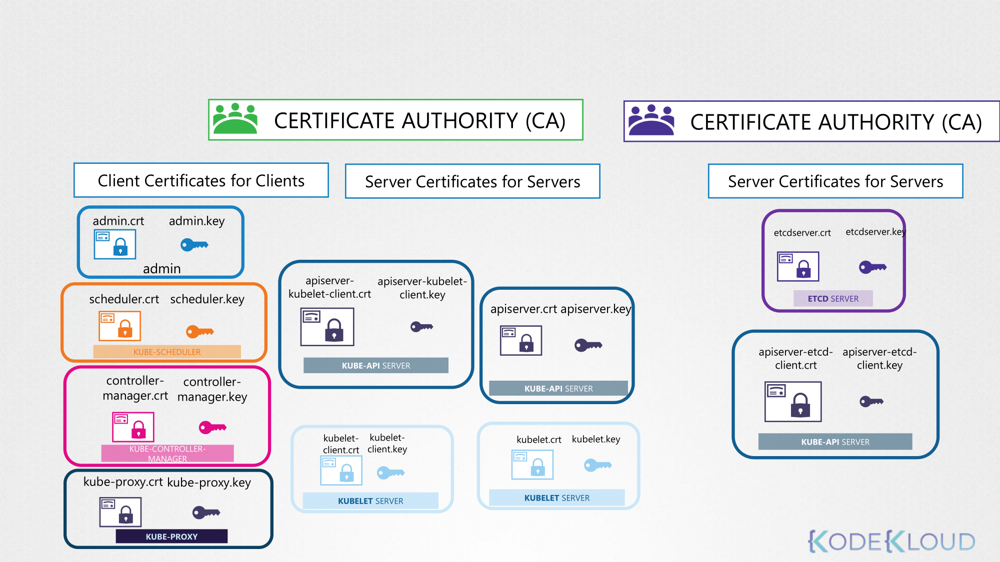

# Security

## Security Primitives

- 호스트에 대한 모든 액세스는 보안되어야 한다.
- 루트 액세스는 비활성화되어야 하며, 암호 기반 인증도 비활성화되어야 한다.
- 오직 SSH Key를 기반으로 한 인증만 사용할 수 있다.
- kube-apiserver는 쿠버네티스의 모든 동작의 중심으로, api에 직접 접근하거나 kubectl을 통해 상호작용하게 된다.
- 첫 번째 방어선인 kube-apiserver에 대한 접근을 어떻게 제어할 수 있을까? 아래의 두 가지로 결정해야 한다:
  - 누가 클러스터에 접근할 수 있는가?
  - 무엇을 할 수 있을까?

### Who can access?

- 인증 메커니즘에 의해 결정된다. 여러 가지 방법이 존재한다.
  - Files - Username and Passwords
  - Files - Username and Tokens
  - Certificates
  - External Authentication providers - LDAP
  - Service Accounts

### What can they do?

- RBAC Authorization - Role Based Access Control
- ABAC Authorization - Attribute Based Access Control
- Node Authorization
- Webhook Mode
- etcd 클러스터, kube-controller-manager, kube-scheduler, kube-apiserver 와 같은 다양한 구성 요소 사이의 모든 통신은 TLS Encryption 에 의해 보호된다.
- 클러스터 내의 애플리케이션 간의 통신은 네트워크 폴리시에 의해 제한된다.

## Authentication

- 쿠버네티스는 사용자 계정을 관리하지 않고 사용자를 관리하기 위해 외부 소스(파일, 인증서, LDAP 등)에 의존한다.
- 사용자를 제외한 서비스어카운트의 경우 생성하고 관리할 수 있다.
- 아래 명령어를 통해 서비스어카운트를 생성할 수 있다.
  ```bash
  kubectl create serviceaccount sa1
  ```

### Static Password File (Deprecated in 1.19)

- 사용자와 비밀번호의 리스트를 담은 csv 파일을 생성하고 사용할 수 있다.
- 해당 csv 파일에는 user, userID, password 세 개의 컬럼이 있다.
- `--basic-auth-file` 옵션에 파일 경로를 지정하여 사용할 수 있다.
- kubeadm을 사용한다면 kube-apiserver의 스태틱 파드에 `--basic-auth-file` 옵션을 추가한다.

### Static Token File

- 비밀번호 대신 토큰을 csv 파일에 저장하는 방식이다.
- `--token-auth-file` 옵션에 파일 경로를 지정하여 사용할 수 있다.
- kubeadm을 사용한다면 kube-apiserver의 스태틱 파드에 `--token-auth-file` 옵션을 추가한다.

## TLS Certification

- 쿠버네티스 클러스터는 마스터 노드와 워커 노드로 구성되어 있다.
- 노드들 간의 모든 통신은 보안이 필요하고 반드시 암호화되어야 한다.



- 쿠버네티스에는 각 리소스 간의 안전한 통신을 위해서 키 쌍이 존재하며, 각 증명은 CA에 서명된 증명이어야 한다.
